更新履歴

| 日付       | Version | 備考                              |
|------------|---------|-----------------------------------|
| 2025/09/26 | 1.0.0    | 第1版                             |

**本書について**

本書は、株式会社クリアコードが、RepostConfirmationCancelerを御利用いただく管理者向けに作成した資料となります。2025年9月時点のデータにより作成されており、それ以降の状況の変動によっては、本書の内容と事実が異なる場合があります。また、本書の内容に基づく運用結果については責任を負いかねますので、予めご了承下さい。

本書で使用するシステム名、製品名は、それぞれの各社の商標、または登録商標です。なお、本文中ではTM、®、©マークは省略しています。

\newpage
# システム要件

## 概要

ThinBridgeが対応しているWindowsシステムについて、記述します。

ThinBridgeを利用するために、別途ランタイムライブラリーや追加インストールが必要なコンポーネントは、ありません。

## 動作サポートOS

**クライアント系OS（Active Directoryドメイン参加必須）**

- **Windows 11 (64bit)**
- **Windows 10 (64bit)**

**サーバー系OS（Active Directoryドメイン参加必須）**

- **Windows Server 2022**
- **Windows Server 2019 LTSC**
- **Windows Server 2016 LTSB**

## 動作サポート ブラウザー

- **Internet Explorer 11（LTSB、LTSCのみ）**
- **Google Chrome (最新版)**
- **Firefox (最新版)**
- **Microsoft Edge (最新版) ■レガシーEdgeは非対応**

## 動作サポート リモート環境

- **VMware Horizon / RDSH**
- **Citrix Virtual App and Desktops / XenApp**
- **Microsoft Remote Desktop Serivce (MS-RDS)**

\newpage
# インストール手順

## ThinBridgeインストールについて

ThinBridgeを利用するために、別途ランタイムライブラリー(.netFramework等)の追加インストールは必要ありません。

## インストール方法

**ThinBridgeのセットアップ用のインストーラーは2種類あります。**  
**御利用されるWindows環境に合わせてセットアップファイルを選択してください。**


・Windows 64bit(x64)環境用  
**ThinBridgeSetup_x64.exe**

・Windows 32bit(x86)環境用  
**ThinBridgeSetup_x86.exe**

Windows環境に合っていないセットアップファイルを実行すると以下のメッセージが表示されます。


> このプログラムは  
> x86プロセッサー向けの Windows にしかインストールできません。

対処方法：ThinBridgeSetup_x64.exeを利用してください。

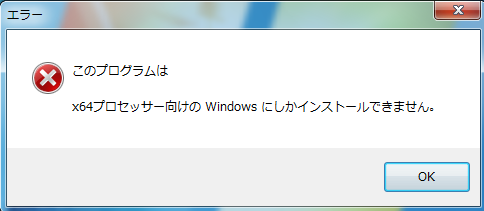

> このプログラムは  
> x64プロセッサー向けの Windows にしかインストールできません。

対処方法：ThinBridgeSetup_x86.exeを利用してください。

**■Windows 11(64bit)、Windows 10(64bit)環境のセットアップ例**

（1） ThinBridgeSetup_x64.exeを実行します。

  
■管理者権限で実行してください。

（2） 「次へ」ボタンをクリックします。

  
■インストール先を変更する場合は、「参照」ボタンよりインストール先を変更します。

（3） 「次へ」ボタンをクリックします。


（4） 「インストール」ボタンをクリックします。


（5） 「完了」ボタンをクリックします。


以上で、インストール作業は完了です。

\newpage
# アンインストール手順

## アンインストール方法 

（1）コントロールパネルより「プログラムと機能」を表示します。  
**■管理者権限で実行してください。**

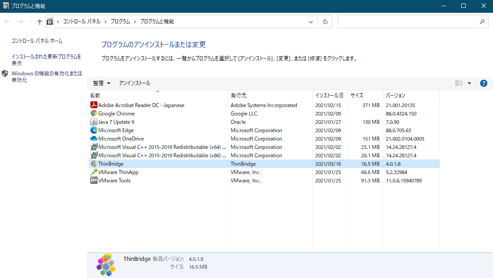

（2）一覧より「ThinBridge」を選択しダブルクリックします。


（3）「はい」ボタンをクリックします。

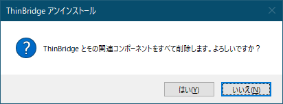


（4）アンインストールが完了するとメッセージが表示されます。  
[OK]をクリックします。


（5）`<インストール先>\ThinBridge`フォルダーを削除します。


以上でアンインストールは、完了です。

\newpage
# サイレント インストール手順（自動インストール）

## ThinBridgeサイレント インストールについて

ThinBridgeのインストールをサイレント実行するための手順について記載します。

以下の環境用のSetupではサイレント インストールが可能です。  
**■管理者権限での実行が必要です。**

1.  応答ファイルの作成  
**■デフォルト値でのサイレントインストールの場合は応答ファイルの作成は不要です。**

2.  サイレント インストールによるSetupの実行.

## 応答ファイルの作成

（1）メモ帳を起動し`ThinBridge.inf`ファイルを作成します。


（2）メモ帳に設定値を記述します。  
カスタマイズ可能な項目は、インストール先とスタートメニューフォルダー名になります。

**インストール先：**  
**Dir=**

**スタートメニューフォルダー名：**  
**Group=**

```
[Setup]
Lang=jp
Dir=C:\Program Files\ThinBridge
Group=ThinBridge
NoIcons=0
Tasks=
```

## サイレント インストール

**デフォルト値でのサイレント インストールの場合**  
**■デフォルト値でのサイレントインストールの場合は応答ファイルの作成は不要です。**

（1）セットアップ用のEXEファイルに「/SP- /VERYSILENT」オプションを付与し実行します。  
例) ThinBridgeSetup_x64.exe /SP- /VERYSILENT</p>


**応答ファイルを利用したサイレント インストールの場合**

（1）セットアップ用のEXEファイルに「/SP- /VERYSILENT **/LOADINF="ThinBridge.inf"**」オプションを付与し実行します。  
例) ThinBridgeSetup_x64.exe /SP- /VERYSILENT /LOADINF="ThinBridge.inf"

■応答ファイル ThinBridge.infはSetupファイルと同一フォルダーに設置するかフルパスを指定します。


\newpage
# サイレント アンインストール手順（自動アンインストール）

## ThinBridgeサイレント アンインストールについて

ThinBridgeのアンインストールをサイレント実行するための手順について記載します。

以下の環境用のSetupではサイレント アンインストールが可能です。  
**■管理者権限での実行が必要です。**  
**ログ関連のフォルダーや設定ファイル関連はアンインストール後に削除されません。**

## サイレント アンインストール

（1）ThinBridgeセットアップ先にあるunins000.exeファイルに「/VERYSILENT」オプションを付与し実行します。  
例) `C:\Program Files\ThinBridge\unins000.exe /VERYSILENT`


\newpage
# バージョンアップ手順

## ThinBridgeバージョンアップについて

ThinBridgeのアンインストールの必要はありません。上書きインストールを行ってください。  
■マイナーバージョンアップの場合はアンインストールの必要はありません。

## バージョンアップ方法

**ThinBridgeのセットアップ用のインストーラーは2種類あります。**  
**御利用されるWindows環境に合わせてセットアップファイルを選択してください。**

・Windows 64bit(x64)環境用  
**ThinBridgeSetup_x64.exe**

・Windows 32bit(x86)環境用  
**ThinBridgeSetup_x86.exe**

Windows環境に合っていないセットアップファイルを実行すると以下のメッセージが表示されます。


> このプログラムは  
> x86プロセッサー向けの Windows にしかインストールできません。

対処方法：ThinBridgeSetup_x64.exeを利用してください。


> このプログラムは  
> x64プロセッサー向けの Windows にしかインストールできません。

対処方法：ThinBridgeSetup_x86.exeを利用してください。

**■Windows 11(64bit)、Windows 10(64bit)環境のセットアップ例**

（1）ThinBridgeSetup_x64.exeを実行します。  
**■管理者権限で実行してください。**


（2）「インストール」ボタンをクリックします。

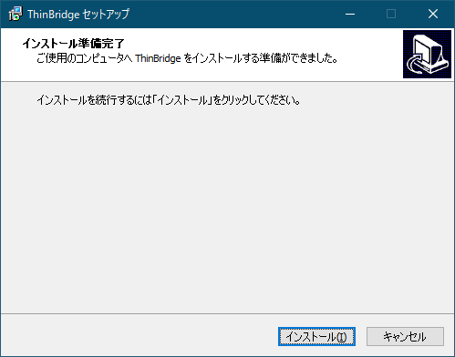

（3）「完了」ボタンをクリックします。

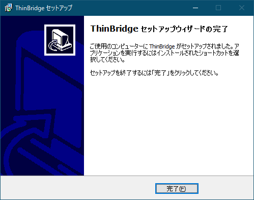

以上で、バージョンアップ作業は完了です。

\newpage
# Internet Explorer ThinBridgeアドオン設定手順

## Internet ExplorerへのThinBridgeアドオン設定手順について

Internet Explorerのアドオンインストールは、ThinBridgeSetupの中で自動的に行われますが
ThinBridgeによるリダイレクトを動作させるためには、アドオンを「有効化」する必要があります。

## ThinBridgeアドオンの有効化

（1）**インストール後に初めてInternet Explorerを起動すると以下の画面が表示されます。**

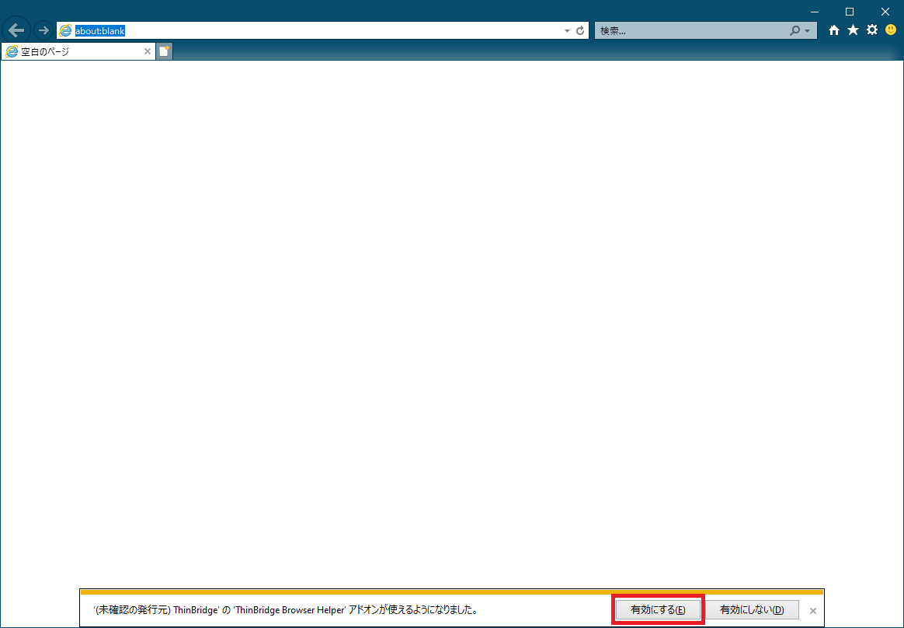

「有効にする」をクリックしてください。

（2）「アドオンの管理」からThinBridge Browser Helperが有効になっていることを確認します。


## グループポリシー(GPO)を利用したThinBridgeアドオンの有効化手順

（1）グループポリシーエディターを起動します。

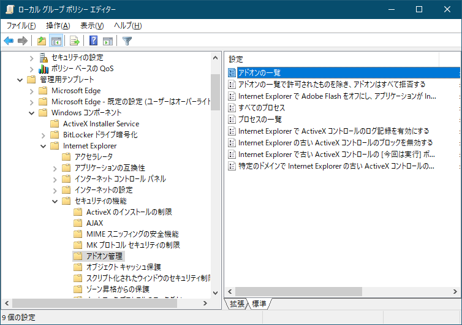

（2）「管理用テンプレート」―「Windowsコンポーネント」―「Internet Explorer」―「セキュリティの機能」―「アドオン管理」を選択します。  
「アドオンの一覧」をダブルクリックします。

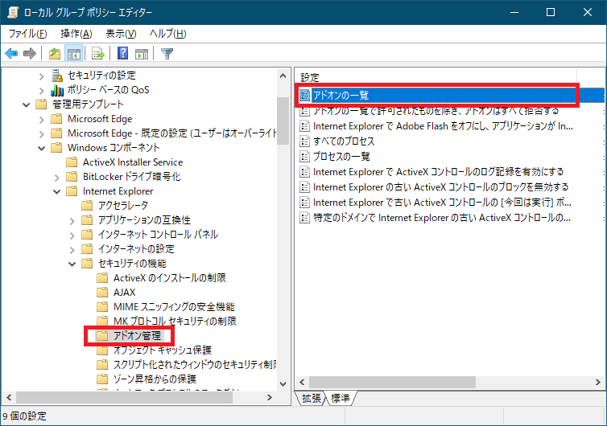

（3）「有効」を選択します。

アドオンの一覧：「表示…」をクリックします。

表示するコンテンツ画面でThinBridgeアドオンID  

値の名前：{3A56619B-37AC-40DA-833E-410F3BEDCBDC}  
値：1  

を入力します。


| **項目**           | **値**                                 | **説明**     |
|--------------------|----------------------------------------|--------------|
| **値の名前**       | {3A56619B-37AC-40DA-833E-10F3BEDCBDC}  | Class ID     |
| **値**             | 1                                      | 有効         |

（4）グループポリシーが適用されると、レジストリの以下のキーに値が追加されます。

`\SOFTWARE\Microsoft\Windows\CurrentVersion\Policies\Ext`  
名前：ListBox_Support_CLSID  
種類：REG_DWORD  
データ：1

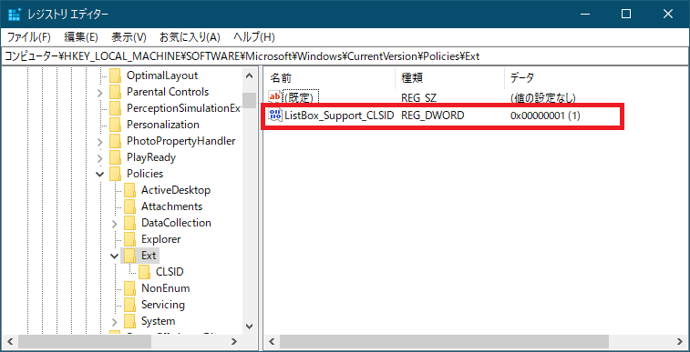

`\SOFTWARE\Microsoft\Windows\CurrentVersion\Policies\Ext\CLSID`  
名前：{3A56619B-37AC-40DA-833E-410F3BEDCBDC}  
種類：REG_SZ  
データ:1


（5）グループポリシーを利用し自動的にアドオンが有効化されます。  
ユーザーは、アドオンの無効化を行うことはできません。


\newpage
# Microsoft Edge ThinBridge拡張導入手順

## Microsoft EdgeへのThinBridge拡張導入手順について

Microsoft Edgeへの拡張機能の導入はグループポリシー(GPO)を利用して行います。

Microsoft Edge アドオンサイトからのユーザー権限インストールでは使用できませんので、ご注意ください。

## グループポリシー(GPO)を利用したThinBridge拡張の導入手順

**予めMicrosoft Edgeのグループポリシー設定が完了した環境での手順になります。**

詳しくは、「Windowsデバイスで Microsoft Edge ポリシー設定を構成する」を参照ください。  
https://learn.microsoft.com/ja-jp/deployedge/configure-microsoft-edge

（1）グループポリシーエディターを起動します。


（2）「管理用テンプレート」―「Microsoft Edge」―「拡張機能」を選択します。  
「サイレント インストールされる拡張機能を制御する」をダブルクリックします。


（3）「有効」を選択します。

オプション：  
「表示…」をクリックします。

表示するコンテンツ画面でThinBridge拡張アプリID「famoofbkcpjdkihdngnhgbdfkfenhcnf」を入力します。

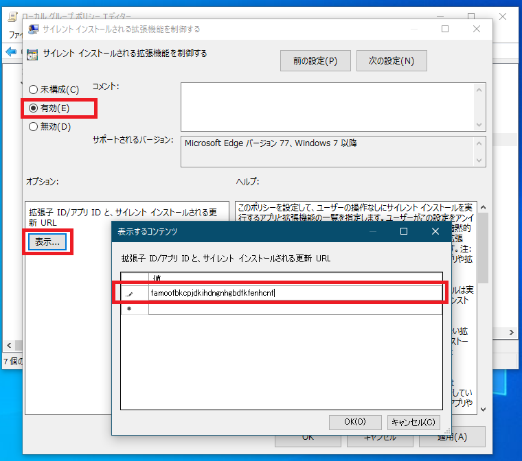

■ThinBridge拡張アプリID  
famoofbkcpjdkihdngnhgbdfkfenhcnf

（4）グループポリシーが適用されると、レジストリの以下のキーに値が追加されます。

`\SOFTWARE\Policies\Microsoft\Edge\ExtensionInstallForcelist`


（5）グループポリシーを利用し自動的に拡張機能が有効化されます。  
ユーザーは、拡張機能の削除や無効化を行うことはできません。

グループポリシーが適用されると青のスライドバーの左隣に鍵マークが表示されます。


\newpage
# Mozilla Firefox ThinBridge拡張導入手順

## Mozilla FirefoxへのThinBridge拡張導入手順について

Mozilla Firefoxへの拡張機能の導入には、Firefoxアドオンサイトを利用するか、グループポリシー(GPO)を利用することが可能です。

## ThinBridge拡張導入方法（Firefox アドオン サイト）

**Firefoxへの拡張機能の導入には、インターネットに接続されている必要があります。**

（1）「Firefox向けアドオン」サイトへ接続します。  
**https://addons.mozilla.org/ja/firefox/**


（2）検索欄に「ThinBridge」と入力しEnterキーを押下します。


（3）「＋Firefoxへ追加」ボタンをクリックします。


（4）「追加」ボタンをクリックします。


（5）ThinBridge拡張が導入されているか確認します。

画面右上の「三」ボタンをクリックします。

「アドオン」をクリックします。


（6）インストール済みの拡張機能にThinBridgeが導入されていることを確認します。

画面左にある「拡張機能」リンクをクリックします。  
拡張機能の管理が表示されます。

スライドバーが青になっている状態は、拡張が有効です。

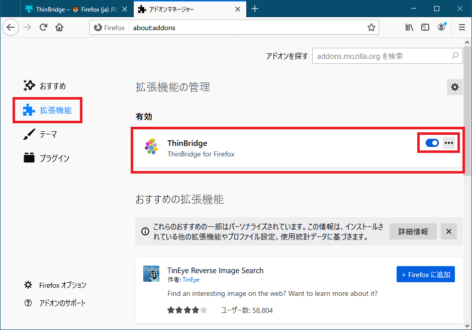

## グループポリシー(GPO)を利用したThinBridge拡張の導入手順

**予めFirefoxのグループポリシー設定が完了した環境での手順になります。**

詳しくは、「グループポリシーを使用して Firefox をカスタマイズする」を参照ください。  
https://support.mozilla.org/ja/kb/customizing-firefox-using-group-policy

（1）グループポリシーエディターを起動します。

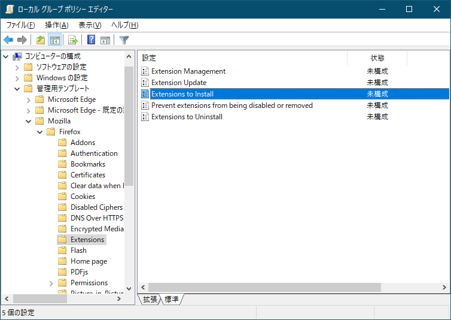

（2）「管理用テンプレート」―「Mozilla」―「Firefox」―「Extensions」を選択します。

「Extensions to Install」をダブルクリックします。


（3）「有効」を選択します。

オプション：  
「表示…」をクリックします。

表示するコンテンツ画面で「https://addons.mozilla.org/firefox/downloads/latest/thinbridge/latest.xpi」を入力します。


■Firefox拡張インストールURL  
https://addons.mozilla.org/firefox/downloads/latest/thinbridge/latest.xpi

（4）「管理用テンプレート」―「Mozilla」―「Firefox」―「Extensions」を選択します。

「Prevent extensions from being disabled or removed」をダブルクリックします。


（5）「有効」を選択します。

オプション：  
「表示…」をクリックします。

表示するコンテンツ画面で「thinbridge@clear-code.com」を入力します。


■Firefox拡張  
thinbridge@clear-code.com

（6）グループポリシーが適用されると、レジストリの以下のキーに値が追加されます。

`\SOFTWARE\Policies\Mozilla\Firefox\Install`  
`\SOFTWARE\Policies\Mozilla\Firefox\Locked`

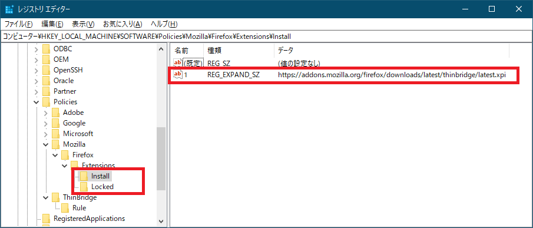

（7）グループポリシーを利用し自動的に拡張機能が有効化されます。  
ユーザーは、拡張機能の削除や無効化を行うことはできません。

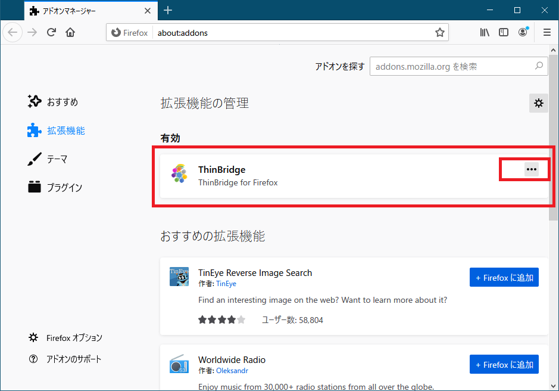

\newpage
# Google Chrome ThinBridge拡張導入手順

## Google ChromeへのThinBridge拡張導入手順について

Google Chromeへの拡張機能の導入はグループポリシー(GPO)を利用して行います。  
Chrome ウェブストアからのユーザー権限インストールでは使用できませんので、ご注意ください。

## グループポリシー(GPO)を利用したThinBridge拡張の導入手順

**予めGoogle Chromeのグループポリシー設定が完了した環境での手順になります。**  

詳しくは、「管理対象パソコンに Chrome ブラウザのポリシーを設定する」を参照ください。  
https://support.google.com/chrome/a/answer/187202?hl=ja

（1）グループポリシーエディターを起動します。


（2）「管理用テンプレート」―「Google」―「Google Chrome」―「拡張機能」を選択します。

「強制インストールするアプリと拡張機能のリストを設定します」をダブルクリックします。


（3）「有効」を選択します。

オプション：  
「表示…」をクリックします。

表示するコンテンツ画面でThinBridge拡張アプリID「iiajmhibpjkpmfmbhegccdfmfnfeffmh」を入力します。

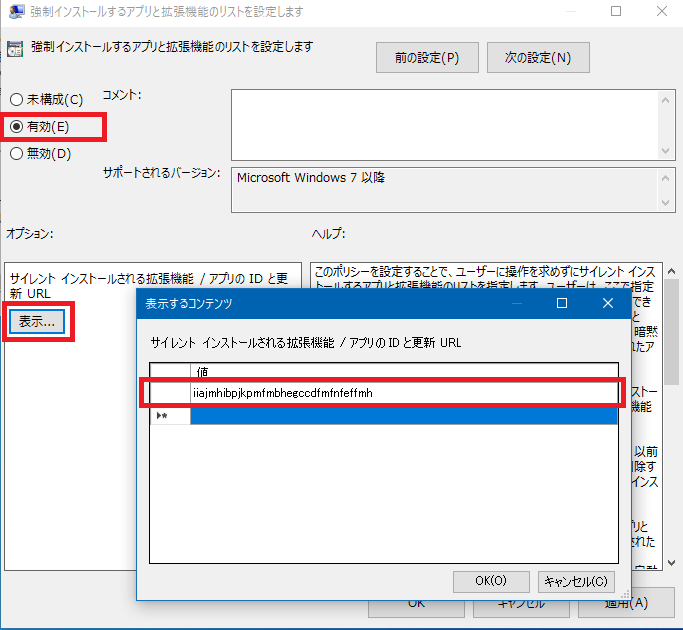

■ThinBridge拡張アプリID  
iiajmhibpjkpmfmbhegccdfmfnfeffmh

（4）グループポリシーが適用されると、レジストリの以下のキーに値が追加されます。

`\SOFTWARE\Policies\Google\Chrome\ExtensionInstallForcelist`


（5）グループポリシーを利用し自動的に拡張機能が有効化されます。  
ユーザーは、拡張機能の削除や無効化を行うことはできません。

グループポリシーが適用されるとアイコンの下に赤丸の企業管理アイコンが表示されます。

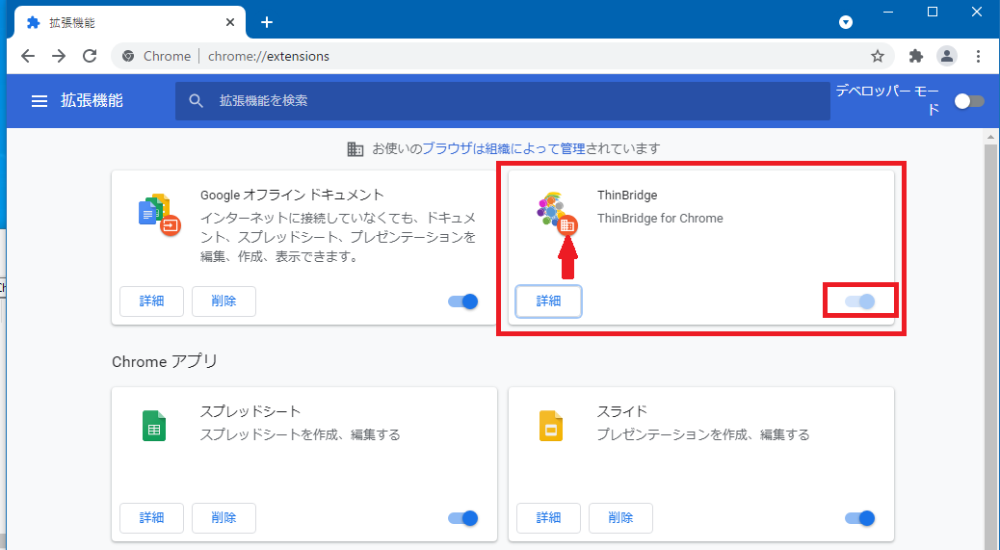

\newpage
# モジュール構成

## ThinBridgeモジュール構成

ThinBridge インストーラーには以下のモジュールが含まれています。(合計 約15MB)

------------------------------------------------------------------------------------------
ファイル名                       サイズ           概要
-------------------------------- ---------------- ----------------------------------------
TBo365URLSyncSetting.exe         約2.1MB          Office365ルール更新設定

TBRedirector.exe                 約356KB          ブラウザー起動モジュール
                                                  外部プログラム連携用

ThinBridge.exe                   約2.6MB          ブラウザー起動モジュール

ThinBridgeChecker.exe            約2.4MB          ThinBridge環境チェッカー

ThinBridgeRuleUpdater.exe        約2.0MB          リダイレクト定義ファイル自動更新

ThinBridgeRuleUpdaterSetting.exe 約2.0MB          リダイレクト定義ファイル自動更新設定

ThinBridgeSetting.exe            約2.0MB          リダイレクト定義設定

ThinBridgeBHO.dll                約316KB          IEアドオン

ThinBridgeBHO64.dll              約374KB          IEアドオン x64用

`ThinBridgeHost\` \              約155KB          モダンブラウザー拡張連携
ThinBridgeTalk.exe

`ThinBridgeHost\` \              約1KB            Microsoft Edge拡張連携
edge.json

`ThinBridgeHost\` \              約1KB            Firefox拡張連携
firefox.json

`ThinBridgeHost\` \              約1KB            Google Chrome拡張連携
chrome.json
------------------------------------------------------------------------------------------
