更新履歴

| 日付       | Version | 備考                              |
|------------|---------|-----------------------------------|
| 2025/09/26 | 1.0.0    | 第1版                             |

**本書について**

本書は、株式会社クリアコードが、RepostConfirmationCancelerを御利用いただく管理者向けに作成した資料となります。2025年9月時点のデータにより作成されており、それ以降の状況の変動によっては、本書の内容と事実が異なる場合があります。また、本書の内容に基づく運用結果については責任を負いかねますので、予めご了承下さい。

本書で使用するシステム名、製品名は、それぞれの各社の商標、または登録商標です。なお、本文中ではTM、®、©マークは省略しています。

\newpage
# ThinBridge概要

## ThinBridgeとは

* ブラウザーの自動切換を行うソリューションです。
* 複数ブラウザー利用に伴う煩わしさを解消しユーザー利便性・生産性の向上
* 幅広いブラウザー（IE、Chrome、Firefox、Edge） リモート環境（VMware Horizon、Microsoft RDS、Citrix Virtual Apps）に対応し、ブラウザー切り換えの架け橋となります。

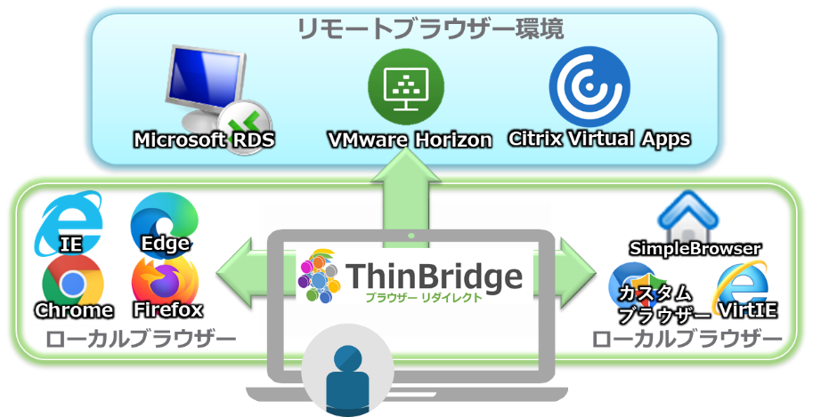

## その背景と使命

ThinBridgeの生い立ちは、ローカルブラウザーとリモートブラウザーの使い分けにおいて発生する煩わしさを解消するために生まれました。

(リモート環境のブラウザーとのURL連携をシームレスに行うためのソリューションとして誕生)

昨今のブラウザーの進化は目を見張るものがあります。数年前では考えられなかった表現力やスピード、拡張性、セキュリティ機能など、その進化は留まることを知りません。

インターネットの世界では、標準化と差別化の中で熾烈な争いが今なお続いています。

代表的なモダンブラウザーとしては、

* Google Chrome
* Microsoft Edge
* Mozilla Firefox

があります。

また、Microsoft365に代表されるSaaSと呼ばれる先進的なWebシステムは絶えず進化が続き、生産性を向上するため、よりリッチでスピーディーに動作するためにモダンブラウザーのみをサポートするものが大半を占めています。

一方、企業・組織内に目を向けてみると社内システムも従来のクライアント-サーバー方式からWebアプリケーション化が進み業務を行う上でWebブラウザーは、なくてはならない存在です。

しかしながら、特定のレガシーブラウザー(Internet Explorer等)をターゲットに開発された企業内システムでは、モダンブラウザーへ全面的に移行することが困難なケースが散見されます。

そのため、利用するWebシステムによってレガシーブラウザー(IE)とモダンブラウザーを併用する必要があり、ブラウザー切り換え操作に課題を抱えられているケースが多々あるかと思います。

■複数ブラウザー切り換え操作が煩雑→生産性の低下→ユーザー満足度の低下

更に、インターネットの脅威から身を守るために、インターネット環境を分離し、リモートブラウザー経由でインターネットを安全に利用し企業・組織内システムでは、ローカルで動作するブラウザーを利用するケースも増えつつあります。

■リモート環境のインターネット閲覧専用ブラウザーと企業・組織内システム用のローカルブラウザー

このように、「複数のブラウザーを用途にあわせ自動的に切り換えたい。」というニーズに答えること、URLを元にした適切なブラウザー環境に橋渡しを行うことでマルチブラウザー利用を最適化する事がThinBridgeの使命です。

## ブラウザーの使い分けが必要な理由

多くのケースでは、企業・組織内で利用するWebシステムがInternet Explorer(IE)用に作り込まれているために、社外のインターネットサイトや、SaaSを利用する場合にモダンブラウザーが必要になります。

■この時点で、IEとモダンブラウザー(Google Chrome等)の併用が発生

さらに、セキュリティ向上のためにインターネット環境を分離し、リモートブラウザー経由でインターネットを安全に利用するケースもあります。

■ローカル環境のIEとGoogle Chrome、リモート環境のインターネット閲覧ブラウザーの合計3つのブラウザー

## ブラウザーの使い分けの課題

複数のブラウザーを利用する場合は、表示したいWebシステムごとにブラウザーを適切に切り換える必要があります。例を上げると

* 企業・組織内で利用するWebシステムは、IEを利用
* SaaS Webシステムは、Google Chromeを利用
* インターネット閲覧の際は、リモートブラウザー(インターネット閲覧用ブラウザー)を利用

この煩雑な切り換え操作をユーザー自身が手動で行う必要があります。

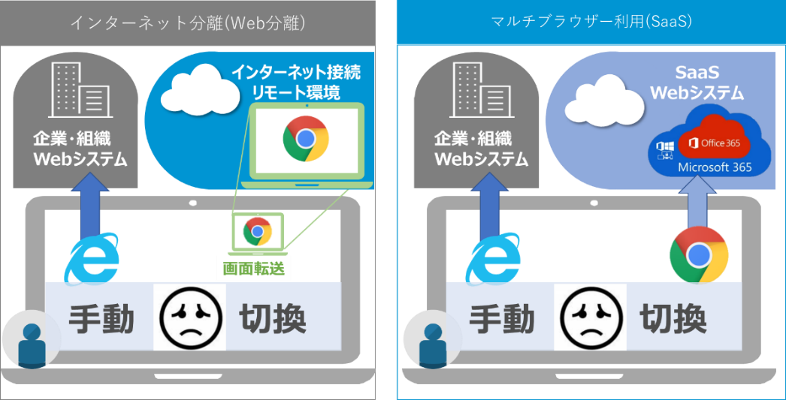

## ThinBridgeによる利便性向上

ThinBridgeを導入すると、ユーザーはURLをクリックするだけ自動的に適切なブラウザーに切り換わります。

1日に何回もIEやChrome、インターネット閲覧用ブラウザーを手動で切り替えることの煩わしさは想像に難くありません。


**【インターネット分離（Web分離）】**

---------------- ----------------------------------------------------------------
背景             Web 分離用にリモート接続環境を導入
                 セキュリティ向上のため、ローカル - リモート間のコピー ＆ ペーストを禁止

課題             手動でのブラウザー切り換えにより、ユーザー利便性・生産性が低下

解決             ThinBridgeによるブラウザー自動切換によりユーザー利便性と生産性を向上
---------------- ---------------------------------------------------------------

**【マルチブラウザー利用】**

---------------- ----------------------------------------------------------------
背景             モダンブラウザーと IEの併用が必要
                 モダンブラウザー：SaaS・Web閲覧用
                 IE：企業・組織内イントラ Web システム用

課題             手動でのブラウザー切り換えにより、ユーザー利便性・生産性が低下

解決             ThinBridgeによるブラウザー自動切換によりユーザー利便性と生産性を向上
---------------- ---------------------------------------------------------------

\newpage
# システム要件

## 概要

ThinBridgeが対応しているWindowsシステムについて、記述します。

ThinBridgeは、Windows 10とWindows 11をクライアントOSとして動作可能です。

また、サーバーOSに関してはWindows Server 2016 LTSB2からWindows Server 2022環境までサポートしています。

ThinBridgeを利用するために、別途ランタイムライブラリーや追加インストールが必要なコンポーネントは、ありません。VMware Horizon / RDSH ,Citrix Virtual Apps and Desktops /XenApp環境もサポートされています。

## 動作サポートOS

**クライアント系OS（Active Directoryドメイン参加必須）**

- **Windows 11 (64bit)**

- **Windows 10 (64bit)**

**サーバー系OS（Active Directoryドメイン参加必須）**

- **Windows Server 2022**

- **Windows Server 2019 LTSC**

- **Windows Server 2016 LTSB**

## 動作サポート ブラウザー

- **Internet Explorer 11（LTSB、LTSCのみ）**

- **Google Chrome (最新版)**

- **Firefox (最新版)**

- **Microsoft Edge (最新版) ■レガシーEdgeは非対応**

## 動作サポート リモート環境

- **VMware Horizon / RDSH**

- **Citrix Virtual App and Desktops / XenApp**

- **Microsoft Remote Desktop Serivce (MS-RDS)**

## ThinBridgeモジュール構成

ThinBridge インストーラーには以下のモジュールが含まれています。(合計 約15MB)

------------------------------------------------------------------------------------------
ファイル名                       サイズ           概要
-------------------------------- ---------------- ----------------------------------------
TBo365URLSyncSetting.exe         約2.1MB          Office365ルール更新設定

TBRedirector.exe                 約356KB          ブラウザー起動モジュール
                                                  外部プログラム連携用

ThinBridge.exe                   約2.6MB          ブラウザー起動モジュール

ThinBridgeChecker.exe            約2.4MB          ThinBridge環境チェッカー

ThinBridgeRuleUpdater.exe        約2.0MB          リダイレクト定義ファイル自動更新

ThinBridgeRuleUpdaterSetting.exe 約2.0MB          リダイレクト定義ファイル自動更新設定

ThinBridgeSetting.exe            約2.0MB          リダイレクト定義設定

ThinBridgeBHO.dll                約316KB          IEアドオン

ThinBridgeBHO64.dll              約374KB          IEアドオン x64用

`ThinBridgeHost\` \              約155KB          モダンブラウザー拡張連携
ThinBridgeTalk.exe

`ThinBridgeHost\` \              約1KB            Microsoft Edge拡張連携
edge.json

`ThinBridgeHost\` \              約1KB            Firefox拡張連携
firefox.json

`ThinBridgeHost\` \              約1KB            Google Chrome拡張連携
chrome.json
------------------------------------------------------------------------------------------

\newpage
# インストール方法

## ThinBridgeインストールについて

ThinBridgeを利用するために、別途ランタイムライブラリー(.netFramework等)の追加インストールは必要ありません。

## インストール方法

**ThinBridgeのセットアップ用のインストーラーは2種類あります。**  
**御利用されるWindows環境に合わせてセットアップファイルを選択してください。**

・Windows 64bit(x64)環境用  
**ThinBridgeSetup_x64.exe**

・Windows 32bit(x86)環境用  
**ThinBridgeSetup_x86.exe**

Windows環境に合っていないセットアップファイルを実行すると以下のメッセージが表示されます。
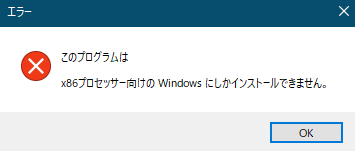

> このプログラムは  
> x86プロセッサー向けの Windows にしかインストールできません。

対処方法：ThinBridgeSetup_x64.exeを利用してください。


> このプログラムは  
> x64プロセッサー向けの Windows にしかインストールできません。

対処方法：ThinBridgeSetup_x86.exeを利用してください。

**■Windows 11(64bit)、Windows 10(64bit)環境のセットアップ例**

（1） ThinBridgeSetup_x64.exeを実行します。

  
■管理者権限で実行してください。

（2） 「次へ」ボタンをクリックします。

  
■インストール先を変更する場合は、「参照」ボタンよりインストール先を変更します。

（3） 「次へ」ボタンをクリックします。

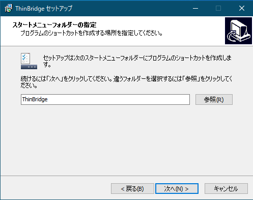

（4） 「インストール」ボタンをクリックします。

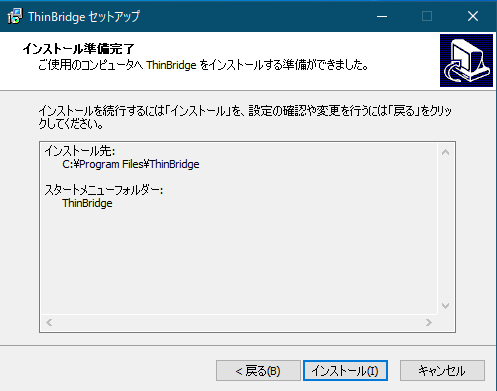

（5） 「完了」ボタンをクリックします。


以上で、インストール作業は完了です。

## ThinBridgeサイレント インストールについて

ThinBridgeのインストールをサイレント実行するための手順について記載します。

以下の環境用のSetupではサイレント インストールが可能です。

**■管理者権限での実行が必要です。**

1.  応答ファイルの作成

**■デフォルト値でのサイレントインストールの場合は応答ファイルの作成は不要です。**

2.  サイレント インストールによるSetupの実行.

## 応答ファイルの作成

（1） メモ帳を起動しThinBridge.infファイルを作成します。

（2） メモ帳に設定値を記述します。


```
[Setup]
Lang=jp
Dir=C:\Program Files\ThinBridge
Group=ThinBridge
NoIcons=0
Tasks=
```

カスタマイズ可能な項目は、インストール先とスタートメニューフォルダー名になります。

**インストール先：**  
**Dir=**

**スタートメニューフォルダー名：**  
**Group=**

## サイレント インストール

**デフォルト値でのサイレント インストールの場合**  
**■デフォルト値でのサイレントインストールの場合は応答ファイルの作成は不要です。**

セットアップ用のEXEファイルに「/SP- /VERYSILENT」オプションを付与し実行します。

例) ThinBridgeSetup_x64.exe /SP- /VERYSILENT  


**応答ファイルを利用したサイレント インストールの場合**

セットアップ用のEXEファイルに「/SP- /VERYSILENT **/LOADINF="ThinBridge.inf"**」オプションを付与し実行します。  

例) ThinBridgeSetup_x64.exe /SP- /VERYSILENT /LOADINF="ThinBridge.inf"  
■応答ファイル ThinBridge.infはSetupファイルと同一フォルダーに設置するか  
フルパスを指定します。  
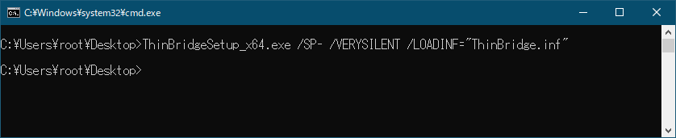

\newpage
# Internet Explorer ThinBridgeアドオン設定手順

## Internet ExplorerへのThinBridgeアドオン設定手順について

Internet Explorerのアドオンインストールは、ThinBridgeSetupの中で自動的に行われますが

ThinBridgeによるリダイレクトを動作させるためには、アドオンを「有効化」する必要があります。

## ThinBridgeアドオンの有効化

（1） **インストール後に初めてInternet Explorerを起動すると以下の画面が表示されます。**

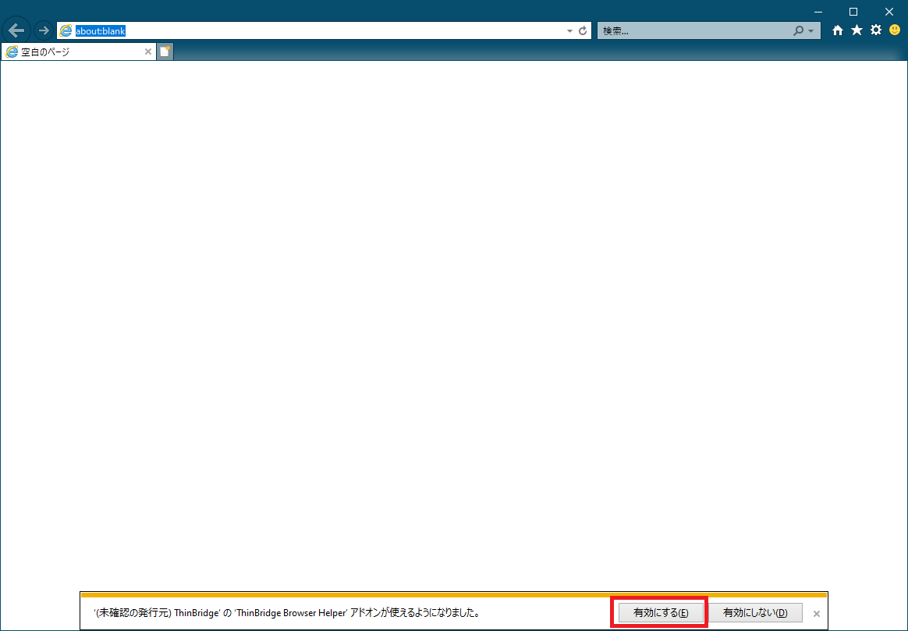{ width=80% }  
「有効にする」をクリックしてください。

（2） 「アドオンの管理」からThinBridge Browser Helperが有効になっていることを確認します。

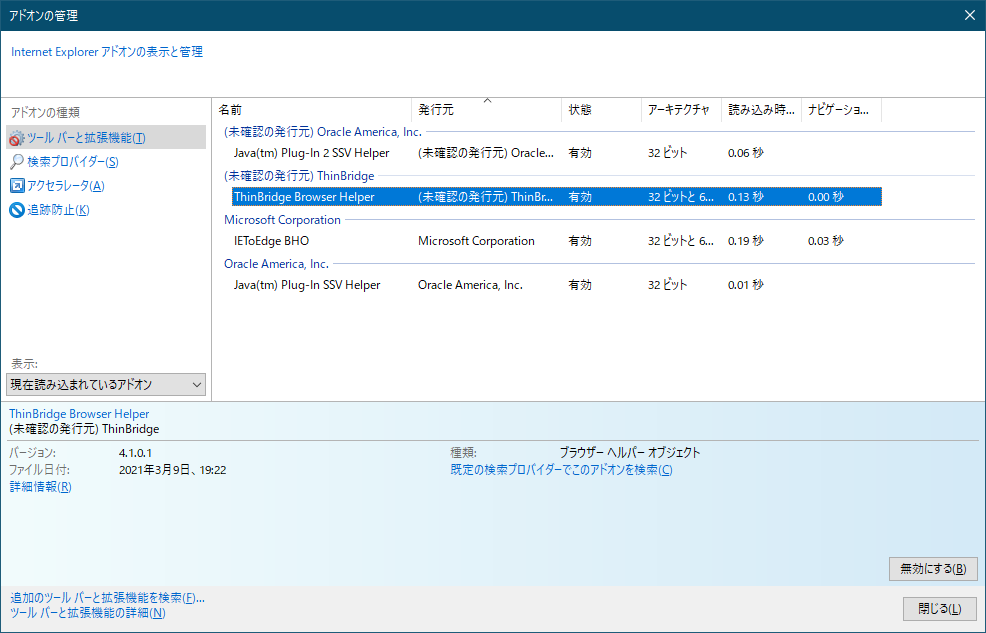{ width=80% }

## グループポリシー(GPO)を利用したThinBridgeアドオンの有効化手順

（1） グループポリシーエディターを起動します。

（2） 「管理用テンプレート」―「Windowsコンポーネント」―「Internet Explorer」―「セキュリティの機能」―「アドオン管理」を選択します。  
「アドオンの一覧」をダブルクリックします。

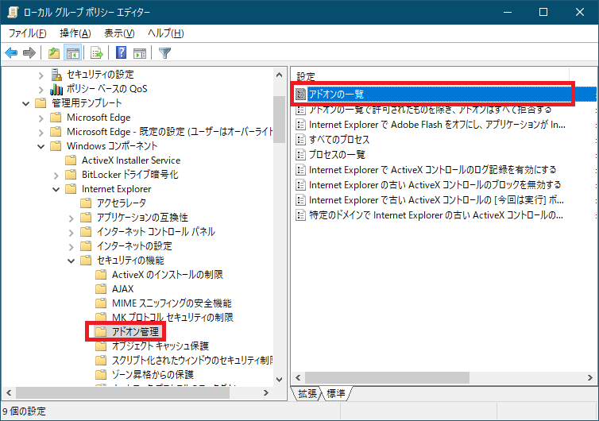{ width=80% }

（3） 「有効」を選択します。  
アドオンの一覧：  
「表示…」をクリックします。  
表示するコンテンツ画面でThinBridgeアドオンID  
値の名前：{3A56619B-37AC-40DA-833E-410F3BEDCBDC}  
値：1  
を入力します。

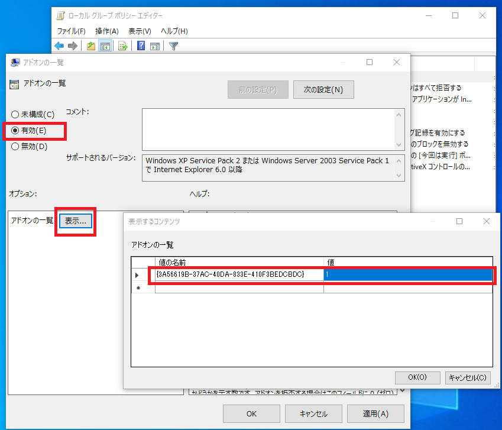

| 項目       | 値                                             | 説明       |
|------------|------------------------------------------------|------------|
| 値の名前   | {3A56619B-37AC-40DA-833E-10F3BEDCBDC}          | Class ID   |
| 値         | 1                                              | 有効       |


（4） グループポリシーが適用されると、レジストリの以下のキーに値が追加されます。

`\SOFTWARE\Microsoft\Windows\CurrentVersion\Policies\Ext`  
名前：ListBox_Support_CLSID  
種類：REG_DWORD  
データ：1  
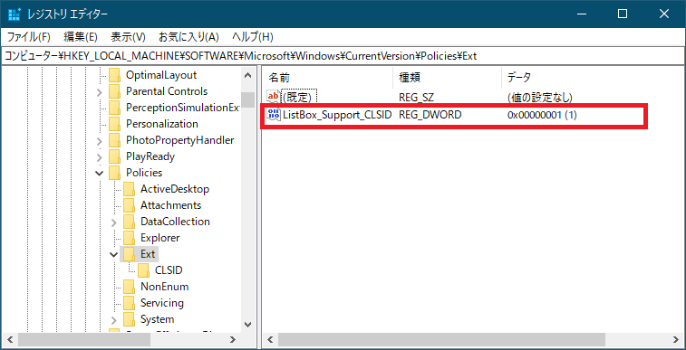

`\SOFTWARE\Microsoft\Windows\CurrentVersion\Policies\Ext\CLSID`  
名前：{3A56619B-37AC-40DA-833E-410F3BEDCBDC}  
種類：REG_SZ  
データ:1  
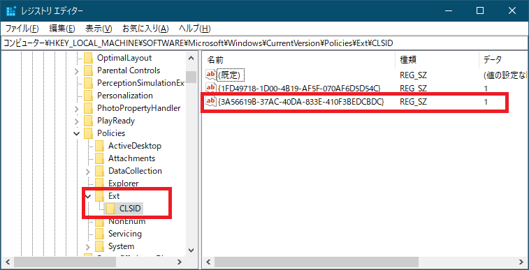

（5） グループポリシーを利用し自動的にアドオンが有効化されます。  
ユーザーは、アドオンの無効化を行うことはできません。

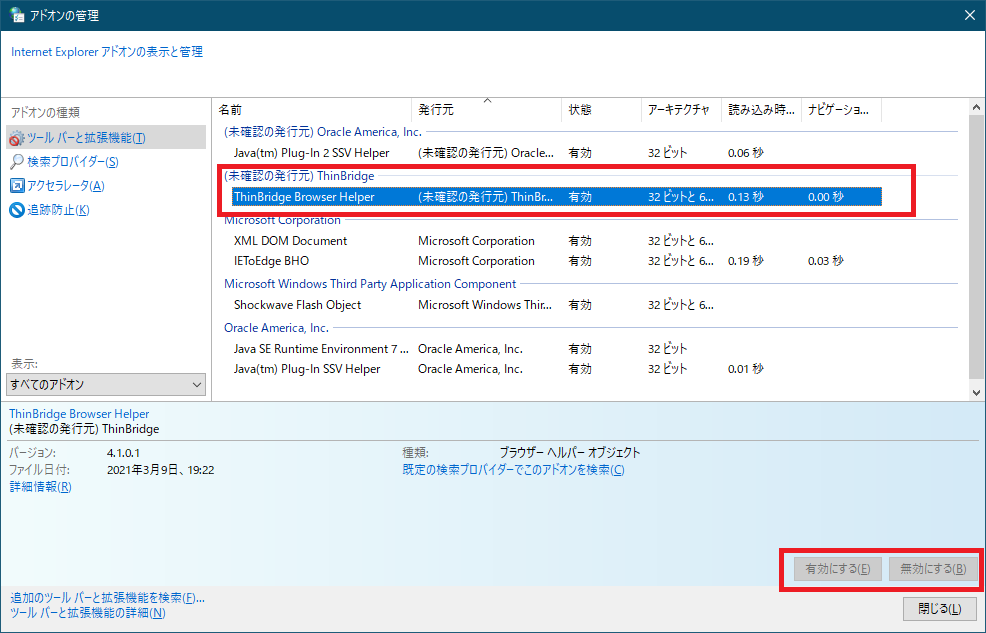

\newpage
# Microsoft Edge ThinBridge拡張導入手順

## Microsoft EdgeへのThinBridge拡張導入手順について

Microsoft Edgeへの拡張機能の導入はグループポリシー(GPO)を利用して行います。

Microsoft Edge アドオンサイトからのユーザー権限インストールでは使用できませんので、ご注意ください。

## グループポリシー(GPO)を利用したThinBridge拡張の導入手順

**あらかじめMicrosoft Edgeのグループポリシー設定が完了した環境での手順になります。**

詳しくは、「Windows デバイスで Microsoft Edge ポリシー設定を構成する」を参照ください。  
[https://learn.microsoft.com/ja-jp/deployedge/configure-microsoft-edge](https://learn.microsoft.com/ja-jp/deployedge/configure-microsoft-edge)

（1） グループポリシーエディターを起動します。

（2） 「管理用テンプレート」―「Microsoft Edge」―「拡張機能」を選択します。  
「サイレント インストールされる拡張機能を制御する」をダブルクリックします。

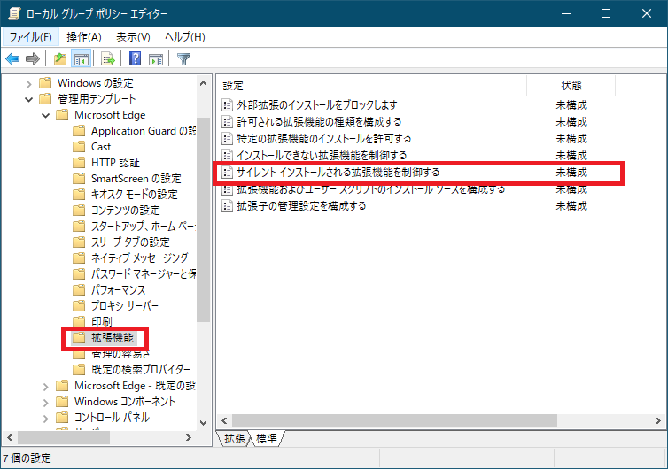

（3） 「有効」を選択します。  

オプション：  
「表示…」をクリックします。  

表示するコンテンツ画面でThinBridge拡張アプリID「famoofbkcpjdkihdngnhgbdfkfenhcnf」を入力します。

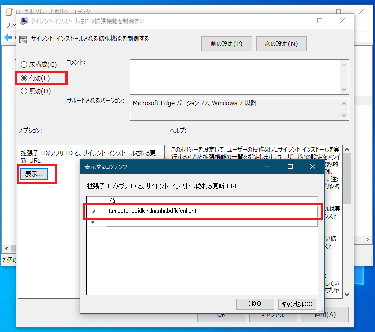

■ThinBridge拡張アプリID  
famoofbkcpjdkihdngnhgbdfkfenhcnf

（4） グループポリシーが適用されると、レジストリの以下のキーに値が追加されます。  
`\SOFTWARE\Policies\Microsoft\Edge\ExtensionInstallForcelist`

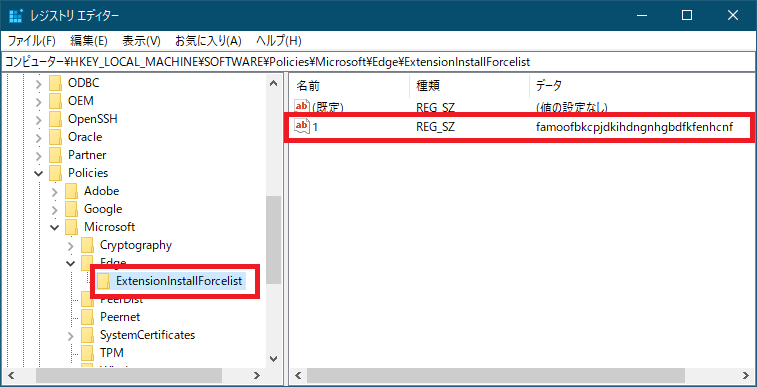

（5） グループポリシーを利用し自動的に拡張機能が有効化されます。  
ユーザーは、拡張機能の削除や無効化を行うことはできません。  
グループポリシーが適用されると青のスライドバーの左隣に鍵マークが表示されます。

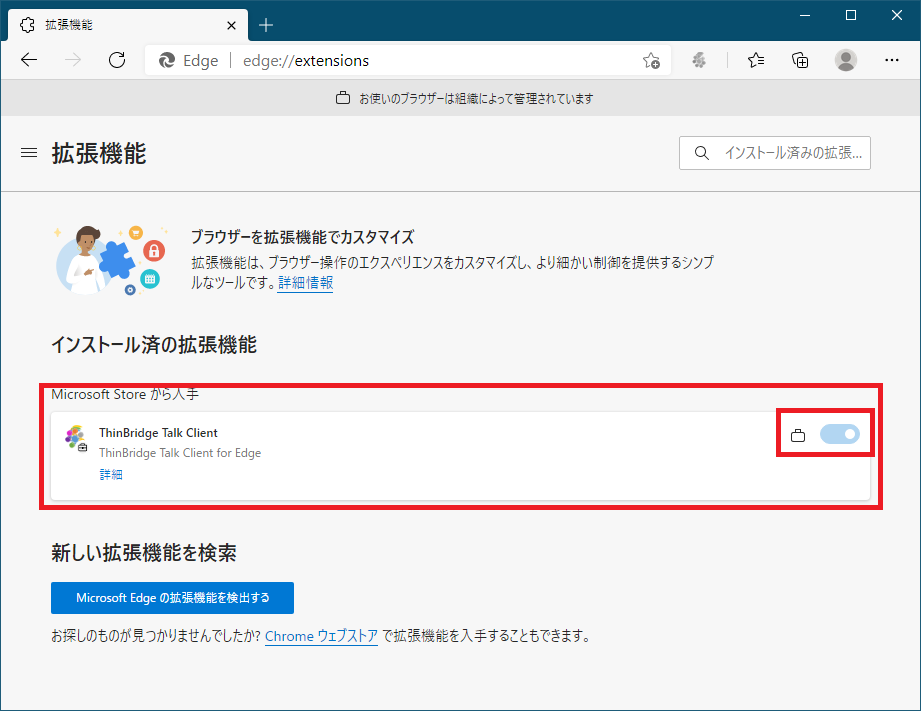

\newpage
# リダイレクト動作シナリオ

## リダイレクト動作シナリオについて

この章では、シナリオに基づいたURLリダイレクトについて記載します。

**シナリオ1.インターネット分離（Web分離）**

---------------- ----------------------------------------------------------------
背景             Web 分離用にリモート接続環境を導入
                 セキュリティ向上のため、ローカル - リモート間のコピー ＆ ペーストを禁止

課題             手動でのブラウザー切り換えにより、ユーザー利便性・生産性が低下

解決             ThinBridgeによるブラウザー自動切換によりユーザー利便性と生産性を向上
---------------- ---------------------------------------------------------------

**シナリオ2.マルチブラウザー利用**

---------------- ----------------------------------------------------------------
背景             モダンブラウザーと IEの併用が必要
                 モダンブラウザー：SaaS・Web閲覧用
                 IE：企業・組織内イントラ Web システム用

課題             手動でのブラウザー切り換えにより、ユーザー利便性・生産性が低下

解決             ThinBridgeによるブラウザー自動切換によりユーザー利便性と生産性を向上
---------------- ---------------------------------------------------------------

## リダイレクト定義設定起動方法

（1） スタートメニューより「リダイレクト定義設定」を実行します。

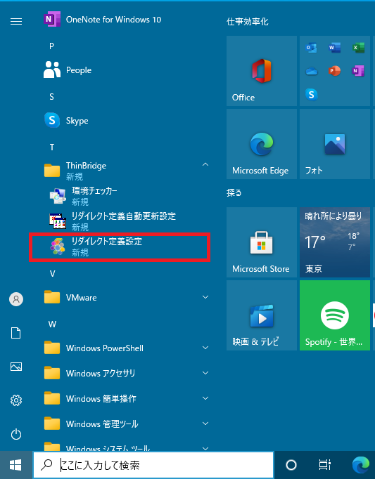

（2） 「リダイレクト定義設定」画面が表示されます。 

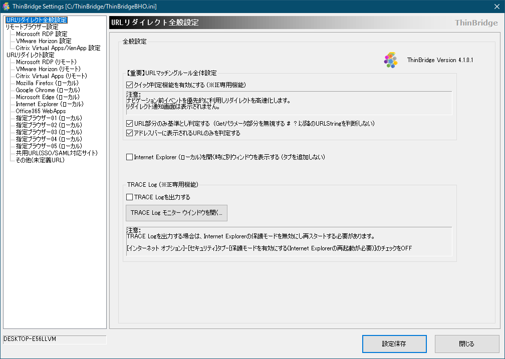

## シナリオ1.インターネット分離（Web分離）

シナリオの想定環境

----------------      ----------------------------------------------------------------
企業・組織Webシステム IEを利用

インターネット        リモート環境(Microsoft RDP) \
                      Google Chromeを利用 \
                      ■Micorosoft RDSサーバーにGoogle Chromeがインストールされている環境を前提としています。
----------------      ----------------------------------------------------------------


### リモートブラウザー設定(Microsoft RDP)設定 （例）

（1） 「リモートブラウザー設定」―「Microsoft RDP設定」を選択します。

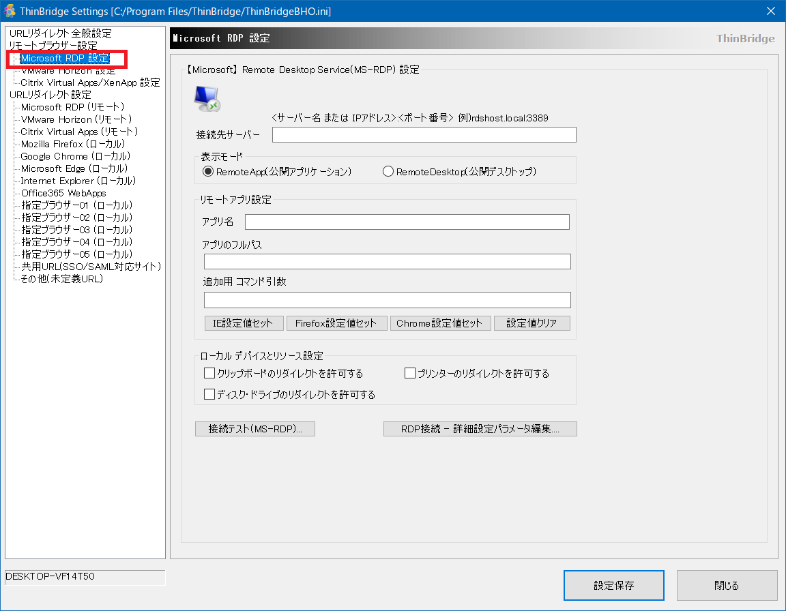

（2） 「接続先サーバー」にRDSサーバー名を入力します。  
「Chrome設定をセット」ボタンをクリックします。

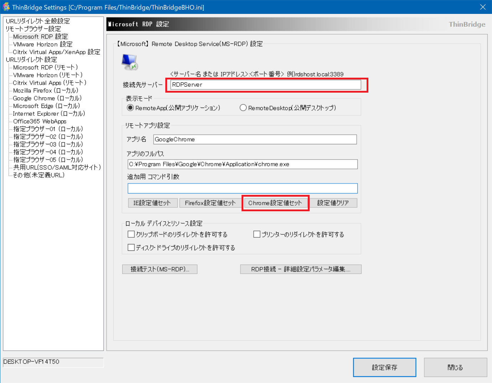

（3） 正しくRDSサーバーに接続できるか確認します。  
「接続テスト(MS-RDP)」ボタンをクリックしURLを入力します。

（4） 正常にRDP環境へ接続されることを確認します。


### URLリダイレクト設定（インターネットサイト）

**ポイント：**
インターネットサイトは、ターゲットURLとして指定することは困難です。  
そのため、ThinBridgeではその他(未定義URL)を利用します。  
■ここで紹介する方法は一例です、これ以外にも設定方法はあります。環境に合わせて実施してください。

（1） 「URLリダイレクト設定」―「その他(未定義URL)」を選択します。  
「ブラウザー種別」より、Micorosoft RDPを選択します。

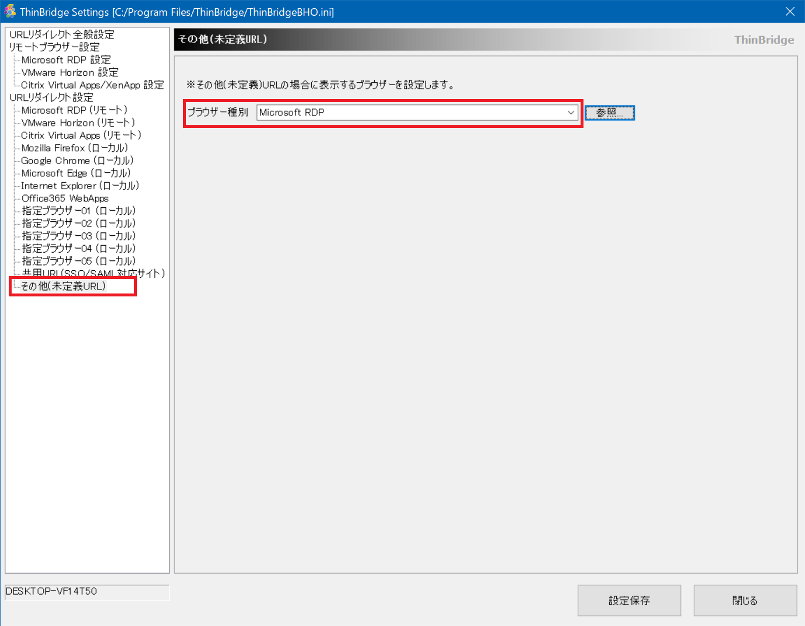

### URLリダイレクト設定（企業・組織Webシステム）

**ポイント：**
企業・組織Webシステムは、Internet Explorerで利用します。  
そのため、ThinBridgeではInternet Explorer(ローカル)を利用します。  
■ここで紹介する方法は一例です、これ以外にも設定方法はあります。環境に合わせて実施してください。

（1） 「URLリダイレクト設定」―「Internet Explorer(ローカル)」を選択します。  
「新規登録」ボタンをクリックします。  
企業・組織WebシステムのURLを登録します。  
例）  
`*://*.local/*`

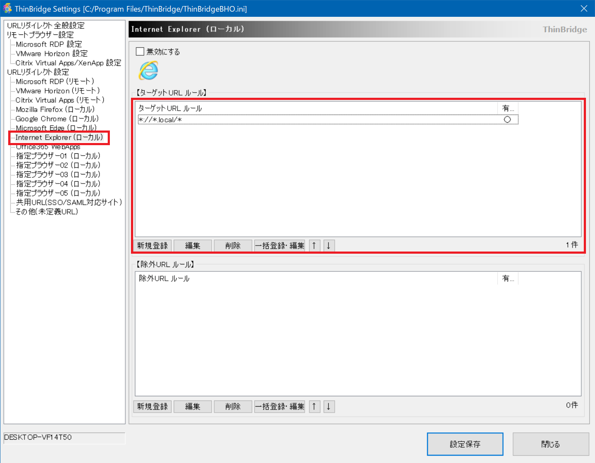

（2） 「設定保存」を行います。

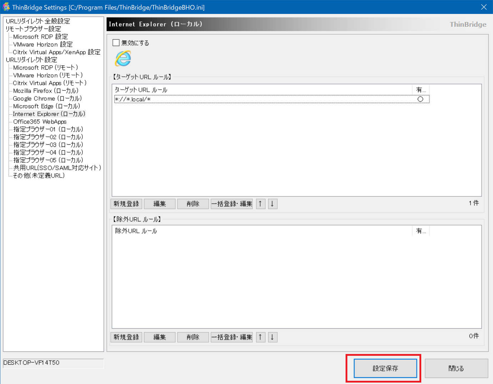

（3） 設定ファイルの保存に成功していることを確認します。

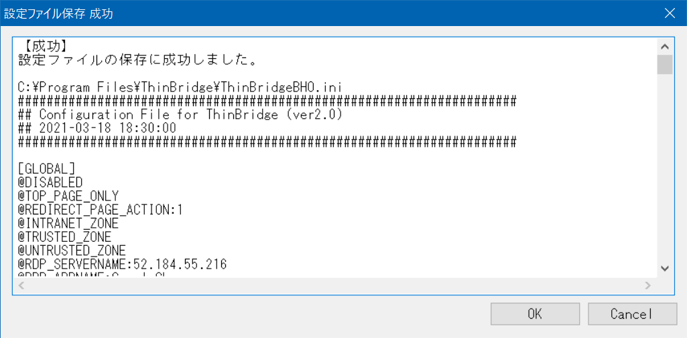

以上でリダイレクト設定作業は完了です。

### URLリダイレクト 動作確認

Internet Explorerからリモートブラウザーへのリダイレクト

（1） Internet Explorerを起動します。  
社内システムを開きます。  
■ここでは例として架空の社内システムを利用しています。

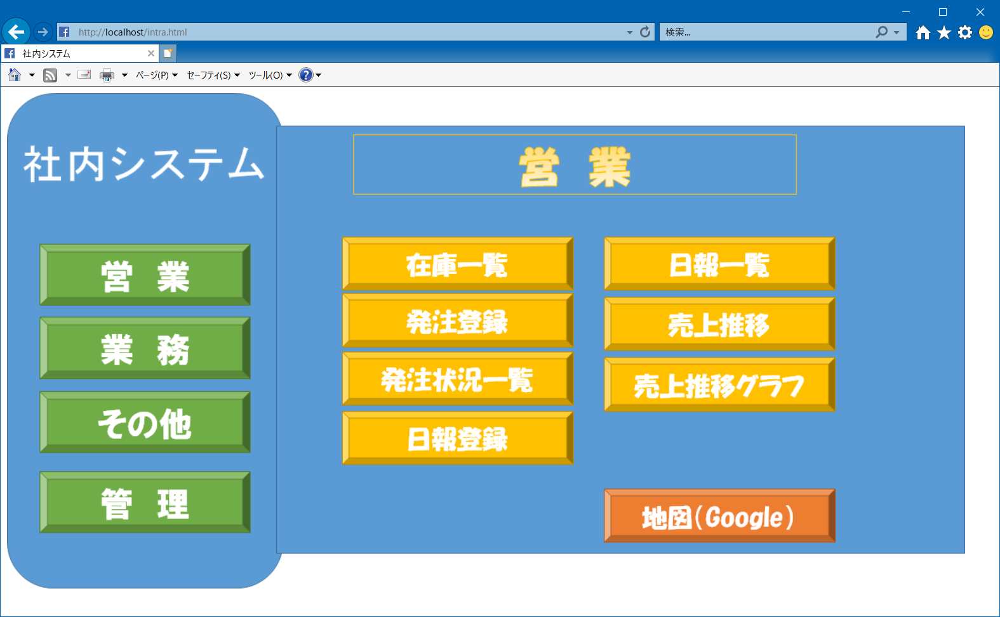

（2） インターネットサイトに該当する「地図（Google）」をクリックします。

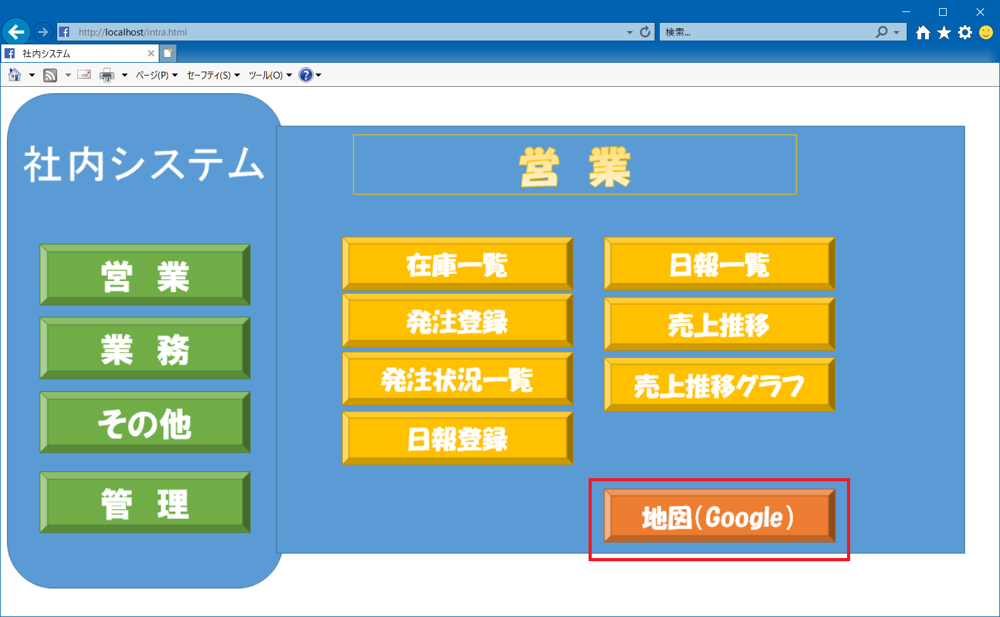

（3） ThinBridgeリダイレクト画面が表示されます。

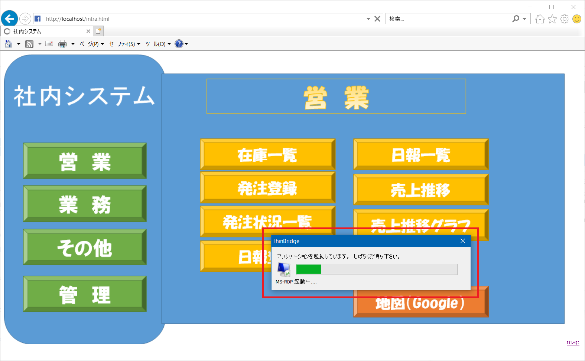

（4） リモートのChromeへとリダイレクトされます。

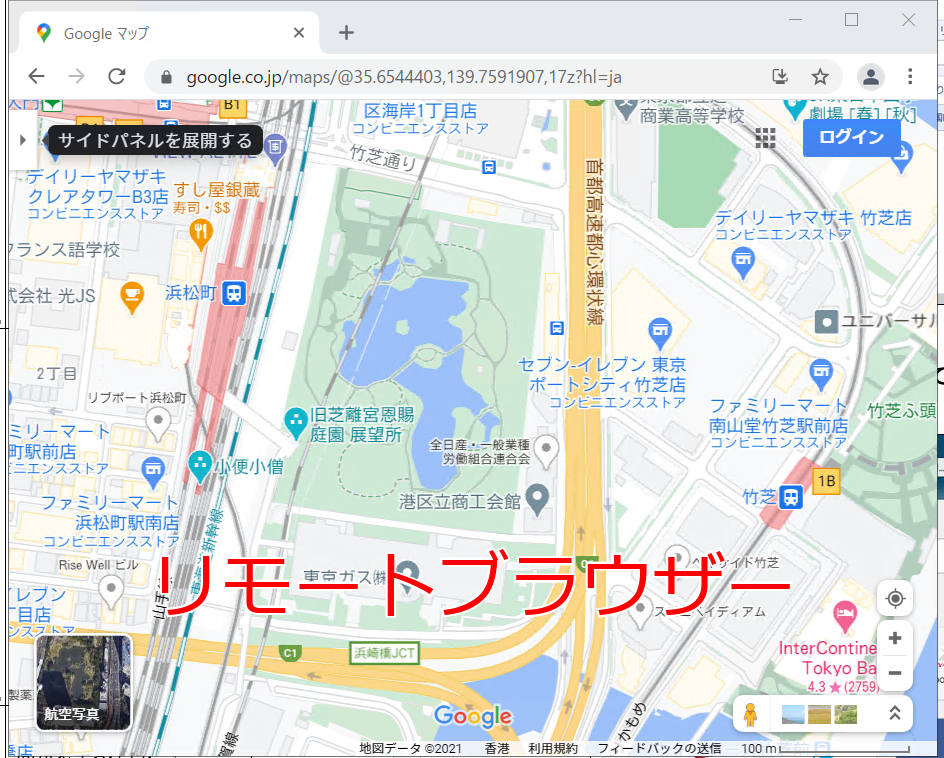

## シナリオ2.マルチブラウザー利用

シナリオの想定環境

----------------      ----------------------------------------------------------------
企業・組織Webシステム IEを利用

・Saasサイト \        Micorosoft Edgeを利用
・インターネット
----------------      ----------------------------------------------------------------

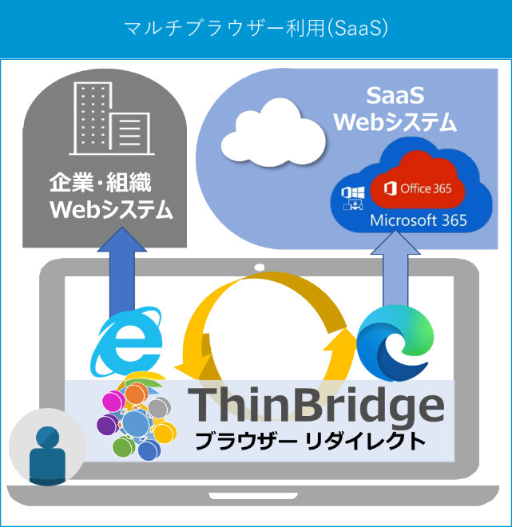

### URLリダイレクト設定（インターネットサイト）

**ポイント：**
インターネットサイトは、ターゲットURLとして指定することは困難です。  
そのため、ThinBridgeではその他(未定義URL)を利用します。  
■ここで紹介する方法は一例です、これ以外にも設定方法はあります。環境に合わせて実施してください。

（1） 「URLリダイレクト設定」―「その他(未定義URL)」を選択します。  
「ブラウザー種別」より、Microsoft Edgeを選択します。

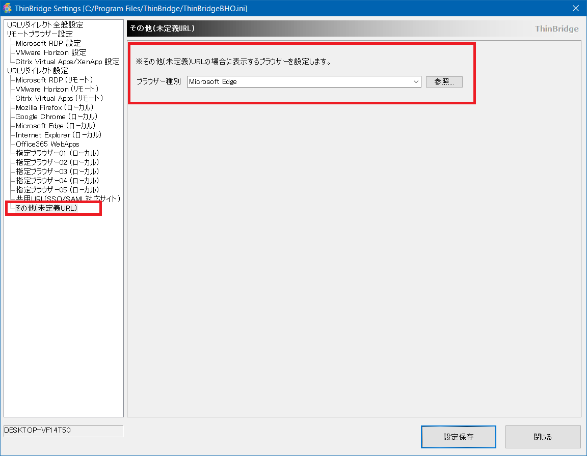

### URLリダイレクト設定（企業・組織Webシステム）

**ポイント：**
企業・組織Webシステムは、Internet Explorerで利用します。  
そのため、ThinBridgeではInternet Explorer(ローカル)を利用します。  
■ここで紹介する方法は一例です、これ以外にも設定方法はあります。環境に合わせて実施してください。

（1） 「URLリダイレクト設定」―「Internet Explorer(ローカル)」を選択します。  
「新規登録」ボタンをクリックします。  
企業・組織WebシステムのURLを登録します。  
例）  
`*://*.local/*`


（2） 「設定保存」を行います。


（3） 設定ファイルの保存に成功していることを確認します。


以上でリダイレクト設定作業は完了です。

### URLリダイレクト 動作確認

Internet ExplorerからMicrosot Edgeへのリダイレクト

（1） Internet Explorerを起動します。  
社内システムを開きます。  
■ここでは例として架空の社内システムを利用しています。


（2） インターネットサイトに該当する「地図（Google）」をクリックします。


（3） ThinBridgeリダイレクト画面が表示されます。

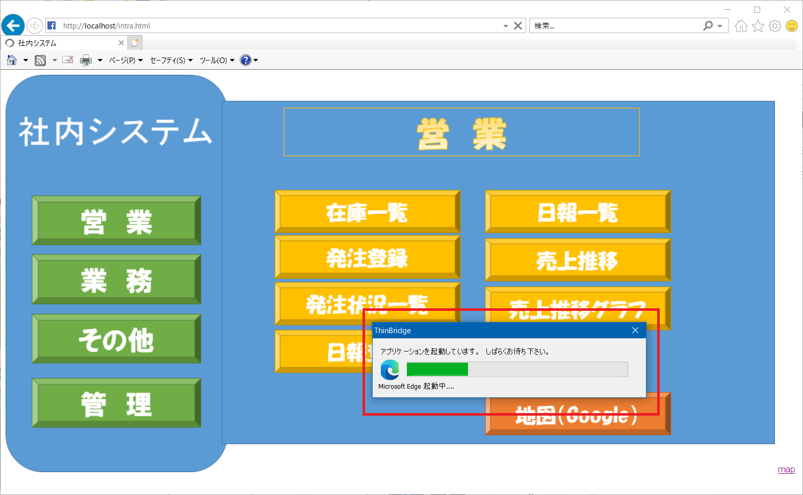

（4） Micorosoft Edgeへとリダイレクトされます。

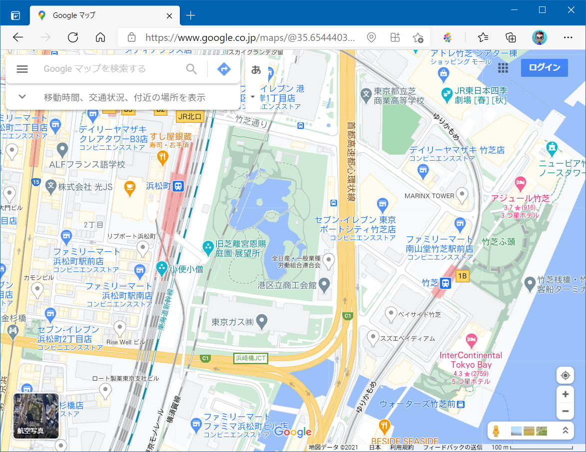

Microsoft EdgeからInternet Explorerへのリダイレクト

（1） Microsoft Edgeを起動します。  
社内システムを開きます。  
■ここでは例として架空の社内システムを利用しています。


（2） ThinBridgeリダイレクト画面が表示されます。


（3） Internet Explorerへとリダイレクトされます。


\newpage
# リソース制限機能（モダンブラウザー専用機能）

## リソース制限機能について

この章では、モダンブラウザー専用のリソース制限機能について記載します。

リソース制限機能を利用すると、モダンブラウザーで開くタブ数を制限することができます。

利用用途としては、インターネット分離（Web分離）用のサーバーを複数人で利用する場合に特定のユーザーがタブを大量に開くとサーバーのコンピュータ資源（リソース）を大量に消費し、コンピュータ全体のリソースが枯渇し他のユーザーに影響を与える可能性があります。

そのため、本機能を利用し予め最大タブ数を設定することでリソースの消費量を抑えることが可能です。

**ユースケース：インターネット分離（Web分離）**

---------------- ----------------------------------------------------------------
背景             Web 分離用にリモート接続環境を導入

課題             一部のユーザーが大量にタブを開いたままにすることで、そのサーバーを利用している他のユーザーのリソースが不足しレスポンスが悪化する。

解決             リソース制限機能を利用し最大タブ数を設定することでユーザー全体の利便を向上
---------------- ---------------------------------------------------------------

**本機能を利用するための注意点：**

* モダンブラウザー専用機能です。IEではこの機能は利用できません。
* ThinBridgeのインストールが必要です。
* モダンブラウザー用のThinBridge拡張機能のインストールが必要です。
* グループポリシー(GPO)を利用し各種設定を行います。（設定用のEXEなどはありません。）

## グループポリシーを利用したリソース制限機能

**追加方法**：

1. ThinBridgeResourceCapSetting.admx ファイルの設置  
   「ThinBridgeResourceCapSetting.admx」を「`C:\Windows\PolicyDefinitions`」フォルダーにコピーします。
2. ThinBridgeResourceCapSetting.admlファイルの設置  
   「ThinBridgeResourceCapSetting.adml」を「`C:\Windows\PolicyDefinitions\ja-JP`」フォルダーにコピーします。

**編集方法**：

グループポリシーエディターを起動します。

\[ユーザーの構成\]-\[管理用テンプレート\]-\[ThinBridge\]-\[リソース制限\]

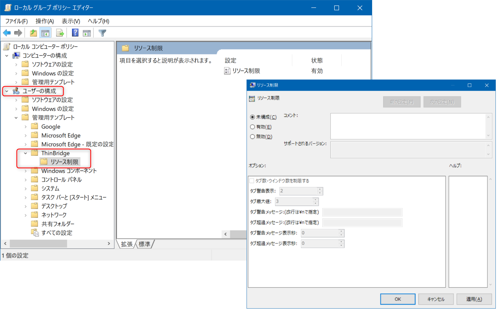

■参考：GPOが適用されると以下のレジストリに値がセットされます。

`HKEY_CURRENT_USER\SOFTWARE\Policies\ThinBridge\RCAP`

**タブ/ウインドウ制限**

----------------------------------------------------------------------------------------------------------
項目名                                   既定値           備考
---------------------------------------- ---------------- ------------------------------------------------
タブ数・ウインドウ数を制限する           OFF              MS-Edgeタブ ・ ウインドウ数を制限する

タブ警告表示                             2                設定した値を超えると警告表示を行います。 \
                                                          タブ・ウインドウは追加されます。 \
                                                          有効範囲：2-99

タブ最大値                               5                設定した値を超えるとエラー表示を行います。 \
                                                          タブ・ウインドウは自動的に閉じられます。

タブ警告メッセージ(改行は`\n`で指定)     （右記）         警告メッセージを設定します。 \
                                                          ------既定値------ \
                                                          【お願い】`\n`現在開いているタブ・ウインドウ数が警告値に達しました。`\n\n`お手数ですが他の不要なタブ・ウインドウを閉じて下さい。`\n\n`コンピュータ資源の節約に、ご協力ください。

タブ超過メッセージ(改行は`\n`で指定)     （右記）         超過メッセージを設定します。 \
                                                          ------既定値------ \
                                                          【お知らせ】`\n`現在開いているタブ・ウインドウ数が上限値に達しました。`\n`これ以上タブ・ウインドウを追加できません。`\n\n`お手数ですが他の不要なタブ・ウインドウを閉じてから再度実行して下さい。`\n\n`コンピュータ資源の節約に、ご協力ください。

タブ警告メッセージ表示秒数               5                警告メッセージを表示する秒数を設定します。 \
                                                          設定秒を超えるとメッセージを自動的に閉じます。 \
                                                          有効範囲：0-60

タブ超過メッセージ表示秒数               5                超過メッセージを表示する秒数を設定します。 \
                                                          設定秒を超えるとメッセージを自動的に閉じます。 \
                                                          有効範囲：0-60
----------------------------------------------------------------------------------------------------------
