更新履歴

| 日付       | Version | 備考                              |
|------------|---------|-----------------------------------|
| 2025/04/14 | 4.2.1.1 | バージョンをプログラムと統一      |
| 2025/04/09 | 2.00    | 2文書を1つに統合し、FAQの章を追加 |
| 2025/03/27 | 1.01    | 微修正                            |
| 2021/03/18 | 1.00    | 第1版                             |

**本書について**

本書は、株式会社クリアコードが、ThinBridgeを御利用いただく管理者向けに作成した資料となります。2025年4月時点のデータにより作成されており、それ以降の状況の変動によっては、本書の内容と事実が異なる場合があります。また、本書の内容に基づく運用結果については責任を負いかねますので、予めご了承下さい。

本書で使用するシステム名、製品名は、それぞれの各社の商標、または登録商標です。なお、本文中ではTM、®、©マークは省略しています。

\newpage
# IEからのリダイレクトに関するトラブルシューティング

## 環境チェッカーを利用し情報を収集します。

環境チェッカーを使用することにより、ThinBridgeの環境情報を収集します。

使用手順については、3.2 「環境チェッカー使用手順」を参照してください。

## リダイレクト定義ファイルの存在を確認します。

ThinBridge環境チェッカー出力内容より、「--ThinBridgeBHO.ini--」セクションを確認します。

■リダイレクト定義ファイルが存在しない場合は以下のように出力されます。

```
--ThinBridgeBHO.ini--
*ERROR* ThinBridgeBHO.ini Failed(File not found) [c:\program files\thinbridge\ThinBridgeBHO.ini]
```

| **項目名**            | **内容**                                          |
|-----------------------|---------------------------------------------------|
| --ThinBridgeBHO.ini-- | リダイレクト定義ファイル(ThinBridgeBHO.ini)の情報 |

対処方法：

正しいリダイレクト定義ファイルを設置して下さい。

## IE用のアドイン（ThinBridgeBrowserHelper）が有効か確認します。

（1）インターネット エクスプローラを起動します。  
「ツール」―「アドオンの管理」を選択します。  
「ThinBridge Browser Helper」が「有効」になっていることを確認します。

■有効になっていない場合は、有効にします。

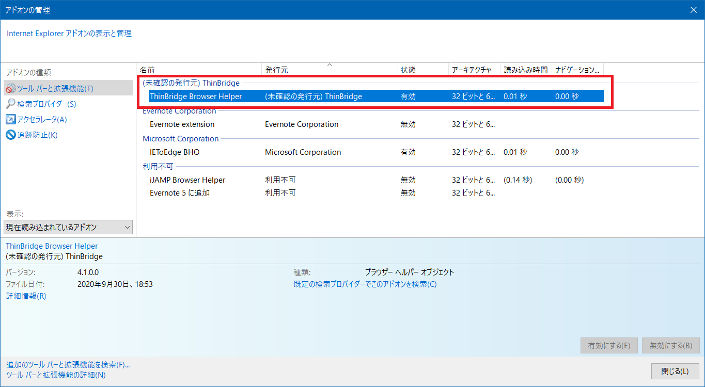

（2）「ツール」―「インターネットオプション」を選択します。  
「詳細設定」タブを選択します。  
「サード パーティ製のブラウザー拡張を有効にする」のチェックがONか確認します。

■チェックがOFFの場合はONにします。

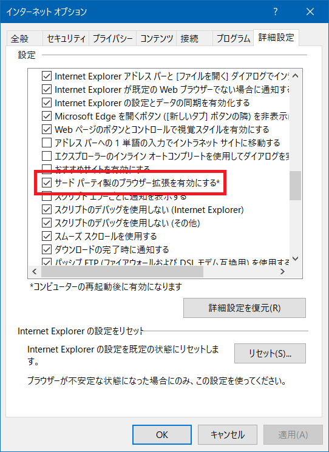

ThinBridge環境チェッカー出力内容から各セクションを確認します。

■IE用アドオン設定に問題がある場合は以下のように出力されます。

```
--ThinBridgeBHO.dll情報--
*ERROR* ThinBridgeBHO_REG Failed(REG_EMPTY_Value)
*ERROR* ThinBridgeBHO_REG Browser Helper Objects Failed(REG_EMPTY_Value) [SOFTWARE\Microsoft\Windows\CurrentVersion\Explorer\Browser Helper Objects\{3A56619B-37AC-40DA-833E-410F3BEDCBDC}]

--ThinBridgeBHO64.dll情報--
*ERROR* ThinBridgeBHO64_REG Failed(REG_EMPTY_Value)

--ThinBridgeBHO 作成チェック--
*ERROR* ThinBridgeBHO Create Failed

--IEサードパーティ製ブラウザー拡張値チェック--
*ERROR*  Internet Explorer Enable Browser Extensions [no]
```

| **項目名**                                     | **内容**                                                       |
|------------------------------------------------|----------------------------------------------------------------|
| --ThinBridgeBHO.dll情報--                      | ThinBridge Browser Helper(IE用アドオン)の情報                  |
| --ThinBridgeBHO64.dll情報--                    | ThinBridge Browser Helper(IE用アドオン)の情報                  |
| --ThinBridgeBHO 作成チェック--                 | ThinBridge Browser Helper(IE用アドオン)の読み込みチェック情報  |
| --IEサードパーティ製ブラウザー拡張値チェック-- | 「サードパーティ製のブラウザー拡張を有効にする」の状態チェック |

■参考）正常な場合の出力例

```
--ThinBridgeBHO.dll 情報--
*SUCCESS* ThinBridgeBHO_REG Success (File Found) [C:\Program Files\ThinBridge\ThinBridgeBHO.dll] [C:\Program Files\ThinBridge\ThinBridgeBHO.dll]
*SUCCESS* ThinBridgeBHO Version 4.1.0.0 [C:\Program Files\ThinBridge\ThinBridgeBHO.dll]
*SUCCESS* ThinBridgeBHO_REG Browser Helper Objects Success
[SOFTWARE\Microsoft\Windows\CurrentVersion\Explorer\Browser Helper Objects\{3A56619B-37AC-40DA-833E-410F3BEDCBDC}]

--ThinBridgeBHO64.dll 情報--
*SUCCESS* ThinBridgeBHO64_REG Success (File Found) [c:\program files\thinbridge\ThinBridgeBHO64.dll]
*SUCCESS* ThinBridgeBHO64 Version 4.1.0.0 [c:\program files\thinbridge\ThinBridgeBHO64.dll]

--ThinBridgeBHO 作成チェック--
*SUCCESS* ThinBridgeBHO Create Success {3A56619B-37AC-40DA-833E-410F3BEDCBDC}

--IE サードパーティ製ブラウザー拡張値チェック--
*SUCCESS* Internet Explorer Enable Browser Extensions [yes]
```

## リダイレクト動作を確認する方法(環境チェッカーを利用)

（1）「リダイレクト動作テストIE」ボタンをクリックします。

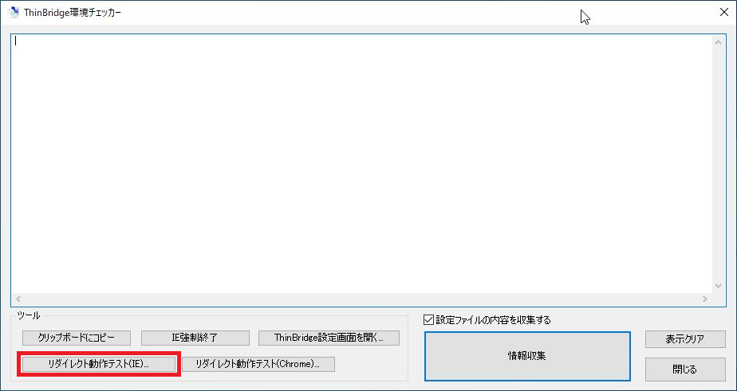

（2）確認したいURLを入力し「OK」ボタンをクリックします。

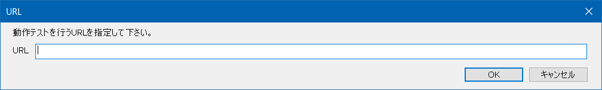

## 特定のURLのみリダイレクトできない場合

リダイレクト出来ないURLがある場合は、リダイレクト定義の設定内容を確認してください。

他のURLがリダイレクト可能な状態であれば、リダイレクト定義の設定内容に不備がある可能性があります。

・ターゲットURLとして設定されていない

・共用URLとして設定されている

リダイレクト定義ファイル作成環境にてリダイレクト定義内容を確認して下さい。

\newpage
# リダイレクト定義(ThinBridgeBHO.ini)自動更新に関するトラブルシューティング

## 基本確認事項

各設定項目に誤りが無いかを確認します。

（1）スタートメニューより「リダイレクト定義自動更新設定」を実行します。

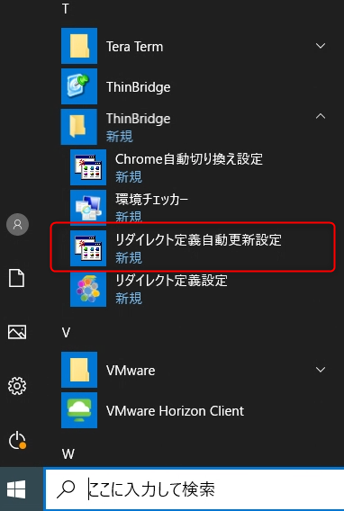

（2）ThinBridgeリダイレクト定義自動更新設定が起動します。

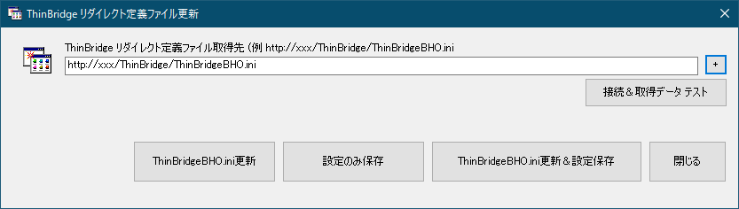 

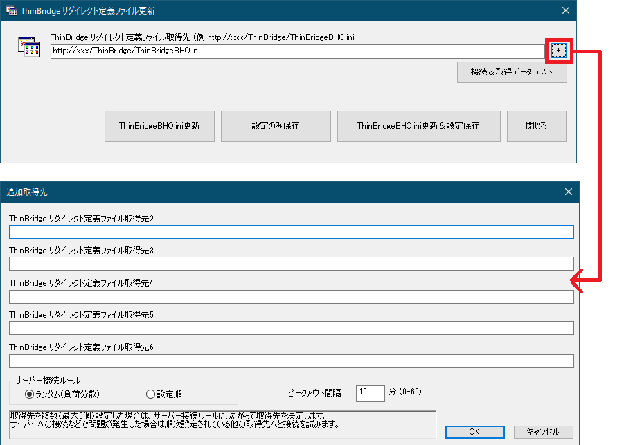

**■各設定項目に誤りが無いかを確認します。**

**誤りがある場合は、正しい値を設定して下さい。**

----------------------------------------------------------------------------------------------------------
項目名                                   既定値           備考
---------------------------------------- ---------------- ------------------------------------------------
ThinBridge リダイレクト定義ファイル \     空白            リダイレクト定義配布サーバーのURL（http/https）を設定します。 \
取得先                                                    対応プロトコル： \
                                                          http/https \
                                                          CIFS(Windowsファイル共有)

ThinBridge リダイレクト定義ファイル \     空白            最大6個 設定可能です。 \
取得先2 \                                                 ■負荷分散用途や耐障害性のために複数設定可能です。 \
取得先3 \                                                 注意： \
取得先4 \                                                 自動更新処理が失敗した場合に次の取得先に接続します。 \
取得先5 \                                                 必ず同じ内容のリダイレクト定義ファイル（ThinBridgeBHO.ini）を配布サーバーに配置して下さい。
取得先6

サーバー接続ルール                       ランダム          サーバーへの接続順を設定します。 \
                                                           **ランダム：** \
                                                           配布サーバーの負荷を分散する場合に設定します。 \
                                                           ランダムに接続先を決定します。 \
                                                           **設定順：** \
                                                           リストの順番に配布サーバーへアクセスします。

ピークアウト間隔 （0-60分）              10分              全ての端末が一斉にサーバーへ接続することが無いように
                                                           負荷を分散するための設定項目です。 \
                                                           設定したピークアウト間隔の範囲で自動更新処理の開始を待機します。待機時間（分）は処理の都度ランダムに決定します。 \
                                                           例）ピークアウト間隔 10分の場合 \
                                                           タスクスケジューラにより毎時0分(ローカル端末の場合)に開始されますが、ピークアウト間隔（10分）の範囲で待機時間をランダムに決定し（0-9分の間）待機した後に自動更新処理を行います。

----------------------------------------------------------------------------------------------------------

## リダイレクト定義自動更新設定 「接続＆取得データテスト」

「接続&データテスト」ボタンを押下します。


### 「接続＆取得データテスト」結果画面

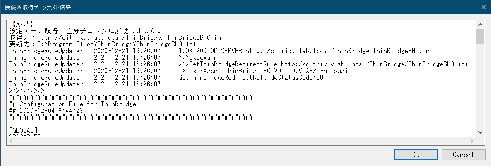

-----------------------------------------------------------------------------------------------------
項目名                               内容
----------------                     ----------------------------------------------------------------
処理結果                             空白 \
                                     エラー：問題が発生しました。 \
                                     【成功】：設定データ取得、差分チェックに成功しました。 \
                                     【同一内容 変更なし】：更新内容に差分がありませんでした。

取得元                               定義ファイルの取得元

更新先                               定義ファイルの更新先

処理結果詳細                         詳細な処理結果

-----------------------------------------------------------------------------------------------------

### エラーが出力される場合

「ThinBridgeリダイレクト定義ファイル取得先」にて問題が発生しています。

## Webブラウザーを利用した定義ファイルダウンロード確認

1.Webブラウザーを起動します。

2.アドレスバーに「リダイレクト定義ファイル取得先」のURLを入力しEnterキーを押下します。


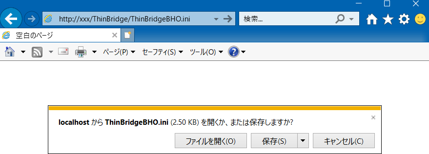

3.正常に定義ファイルがダウンロードできることを確認します。

**■正常に動作しない場合は、「定義ファイル取得先」情報に誤りが無いか。**

**端末と定義ファイル配布サーバーのネットワークに問題は無いか。**

**インターネット接続設定に問題は無いか。**

**定義配布配布サーバーのWebサーバーが正常に稼働しているか確認して下さい。**

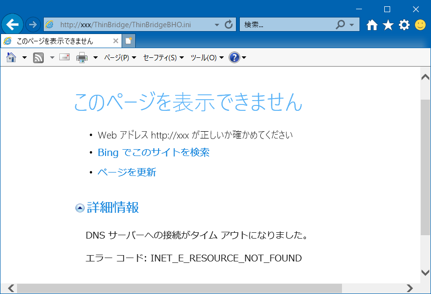

## 自動更新に問題がある場合の確認手順

自動更新処理が定期的に動作しない場合の確認手順

### 自動更新タイミングについて

設定ファイルの自動更新タイミングについて記載します。

* 自動更新タイミング：ログイン時
* 自動更新方法：スタートアップのショートカット

■リダイレクト定義内容に変更がない場合は、チェックのみをおこない、リダイレクト定義ファイル自体は更新しません。

**ログイン時に自動更新されない場合：**

ローカル端末の場合：

スタートアップにThinBridgeリダイレクト定義自動更新のショートカットファイルが存在するか確認します。

存在しない場合は再セットアップを行って下さい。

`C:\ProgramData\Microsoft\Windows\Start Menu\Programs\StartUp\ThinBridgeリダイレクト定義自動更新.lnk`

### リダイレクト定義自動更新が行われたかどうか確認する方法

ThinBridgeセットアップ先のTBUpdateLogフォルダーにログファイルが出力されます。

\<ThinBridgeRuleUpdater年４桁-月2桁-日２桁.log\>

ログは最大過去31日分保持されます。

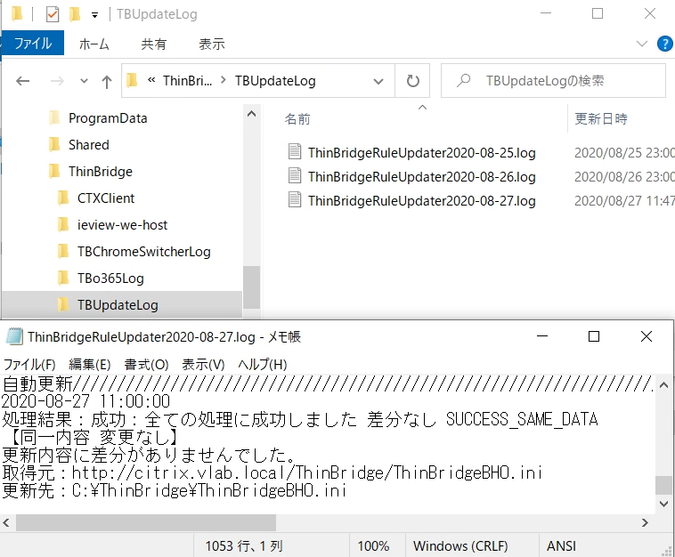

## 自動更新に関するログの確認手順

ThinBridgeセットアップ先のTBUpdateLogフォルダーにログファイルが出力されます。

| **項目**             | **内容**                             |
|----------------------|--------------------------------------|
| ログファイル出力先   | `<インストールパス>\TBUpdateLog\`    |
| ログファイル名       | ThinBridgeRuleUpdaterYYYY-MM-DD.log  |
| ログスイッチ間隔     | 1回/1日                              |
| 保管世代（保存期間） | 31世代（31日）                       |

ログ内容について記載します。

-----------------------------------------------------------------------------------------
項目名                                   内容
---------------------------------------- ------------------------------------------------
処理種別                                 自動更新： ログインや定期実行 \
                                         手動更新：画面操作による手動実行

日時                                     処理日時　YYYY-MM-DD hh:mm:ss

処理結果                                 更新処理結果 \
                                         情報：リダイレクト定義ファイル取得先サーバーが設定されていません。 \
                                         エラー：ThinBridgeBHO.iniファイルが見つかりません。 \
                                         エラー：ThinBridgeBHO.iniファイル オープンエラー \
                                         エラー：ThinBridgeBHO.iniファイルが書込みエラー \
                                         エラー：リダイレクト定義ファイルをサーバーから取得できませんでした。 \
                                         エラー：リダイレクト定義ファイルの内容が不正です。 \
                                         成功：全て処理に成功しました 差分あり SUCCESS_ALL \
                                         成功：ThinBridgeBHO.ini書込み無し-テスト実行成功 \
                                         成功：全ての処理に成功しました 差分なし

ExecUser                                 実行ユーザー

LogonUser                                ログオンユーザー

LogonUserSID                             ログオンユーザー識別子

CurrentSID                               識別子

SettingType                              File：設定ファイルを利用 \
                                         GPO：グループポリシーを利用

取得元                                   定義ファイルの取得元

更新先                                   定義ファイルの更新先

処理結果詳細                             詳細な処理結果

-----------------------------------------------------------------------------------------

## エラー一覧

-------------------------------------------------------------------------------------------------------------------------
エラー内容                                            原因                                 対処方法
----------------------------------------              ----------------------------------   ------------------------------
ERR_SERVER_SESSION  \                                 リダイレクト定義配布サーバー \       リダイレクト定義配布サーバーが正常に動作しているか確認して下さい。
サーバーへのセッションが確立できません。 \            へのセッションが確立できない
インターネット接続を確認してください。

ERR_SERVER_CONNECT \                                  リダイレクト定義配布サーバーへ \     リダイレクト定義配布サーバーが正常に動作しているか確認して下さい。
サーバーへの接続に失敗しました。 \                    接続できない
インターネット接続を確認してください。

ERR_SERVER_SEND_REQUEST  \                            リダイレクト定義配布サーバーへ \     リダイレクト定義配布サーバーが正常に動作しているか確認して下さい。
サーバーへのリクエスト送信で問題が \                  リクエストの送信ができない
発生しています。URLを確認してください。       

ERR_SERVER_RECEIVE_RESPONSE \                         リダイレクト定義配布サーバー \       リダイレクト定義配布サーバーが正常に動作しているか確認して下さい。
サーバーからのレスポンス取得で問題が \                からレスポンスの取得ができない
発生しています。URLを確認してください。

ERR_SERVER_429 Too Many Requests \                    一定時間に大量のリクエストを \       リダイレクト定義配布サーバーの設定を確認して下さい。
一定時間に大量のAPIリクエストを行った結果 \           送信したため
サーバーに拒否されました。

ERR_SERVER_401 アクセスが拒否されました。             リダイレクト定義配布サーバー \       リダイレクト定義配布サーバーの設定を確認して下さい。
                                                      へのアクセスが拒否された

ERR_SERVER_404 ファイルが見つかりません。             リダイレクト定義配布サーバーに \     リダイレクト定義配布サーバーにリダイレクト定義ファイルが設定されているか確認して下さい。 \
                                                      リダイレクト定義ファイルがない       「ThinBridgeリダイレクト定義ファイル取得先」URLに誤りは無いか確認して下さい。

サーバーに接続できません。 \                          リダイレクト定義配布サーバーへ \     リダイレクト定義配布サーバーが正常に動作しているか確認して下さい。 \
ERROR_WINHTTP_CANNOT_CONNECT                          接続できない                         「ThinBridgeリダイレクト定義ファイル取得先」URLに誤りは無いか確認して下さい。

サーバーに接続できません。 \                          リダイレクト定義配布サーバーへ \     リダイレクト定義配布サーバーが正常に動作しているか確認して下さい。 \
ERROR_WINHTTP_CONNECTION_ERROR                        接続できない                         「ThinBridgeリダイレクト定義ファイル取得先」URLに誤りは無いか確認して下さい。

サーバーに接続できません。 \                          リダイレクト定義配布サーバーへ \     リダイレクト定義配布サーバーが正常に動作しているか確認して下さい。 \
ERROR_WINHTTP_INTERNAL_ERROR                          接続できない                         「ThinBridgeリダイレクト定義ファイル取得先」URLに誤りは無いか確認して下さい。

URLが正しくありません。 \                             「ThinBridgeリダイレクト定義 \       リダイレクト定義配布サーバーが正常に動作しているか確認して下さい。 \
ERROR_WINHTTP_INVALID_URL                             ファイル取得先」URLが不正            「ThinBridgeリダイレクト定義ファイル取得先」URLに誤りは無いか確認して下さい。

サーバーに接続できません。（名前解決エラー） \        リダイレクト定義配布サーバーへ \     「ThinBridgeリダイレクト定義ファイル取得先」URLに誤りは無いか確認して下さい。 \
ERROR_WINHTTP_NAME_NOT_RESOLVED                       接続できない                         リダイレクト定義配布サーバーの名前解決が正常に行えるか確認して下さい。

サーバーに接続できません。 \                          リダイレクト定義配布サーバー \       リダイレクト定義配布サーバーが正常に動作しているか確認して下さい。
ERROR_WINHTTP_OPERATION_CANCELLED                     からキャンセルされた

リクエストタイムアウトが発生しました。 \              リダイレクト定義配布サーバー \       リダイレクト定義配布サーバーが正常に動作しているか確認して下さい。
ERROR_WINHTTP_TIMEOUT                                 から応答が一定時間ない

サーバーから取得したThinBridge設定データ \            リダイレクト定義配布サーバー \       リダイレクト定義配布サーバーにリダイレクト定義ファイルが設定されているか確認して下さい。 \
が不正な状態です。 \                                  から取得したリダイレクト定義 \       「ThinBridgeリダイレクト定義ファイル取得先」URLに誤りは無いか確認して下さい。
ERR_SERVER_FORMAT_INVALID                             ファイルが不正状態

空白の場合                                            「ThinBridgeリダイレクト定義 \       「ThinBridgeリダイレクト定義ファイル取得先」を正しく設定して下さい。
                                                      ファイル取得先」が空白

-------------------------------------------------------------------------------------------------------------------------

\newpage
# 環境チェッカーによる確認

## 環境チェッカーについて

環境チェッカーを使用することにより、ThinBridgeの環境情報を収集できます。

## 環境チェッカー使用手順

（1）スタートメニューより「ThinBridge」-「環境チェッカー」を実行します。

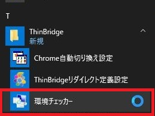

（2）「情報収集」ボタンをクリックします。  
（IEが起動している場合は「IE強制終了」ボタンをクリックしてIEを終了してください。）

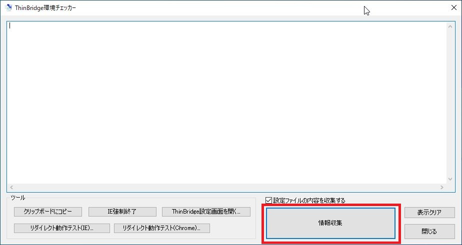

（3）確認画面で「OK」ボタンをクリックします。

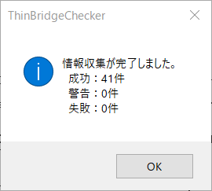

（4）環境情報が表示されるので、内容の確認および、「クリップボードにコピー」ボタンをクリックして情報を収集してください。


## 環境チェッカーによる自動更新設定確認

出力内容より、「--リダイレクト定義自動更新情報--」セクションを確認します。

```
--リダイレクト定義自動更新情報--
#GPO
SOFTWARE\WOW6432Node\Policies\ThinBridge\Rule
ConfigServerURL=
ConfigServerURL2=
ConfigServerURL3=
ConfigServerURL4=
ConfigServerURL5=
ConfigServerURL6=
Interval=0
ServerConnectionRule=0
#File
c:\program files\thinbridge\ThinBridgeRuleUpdater.conf
ConfigServerURL=http://xxx/ThinBridge/ThinBridgeBHO.ini
ConfigServerURL2=
ConfigServerURL3=
ConfigServerURL4=
ConfigServerURL5=
ConfigServerURL6=
Interval=10
ServerConnectionRule=0
KeyCombination=0
```

-----------------------------------------------------------------------------------------
項目名                                   内容
---------------------------------------- ------------------------------------------------
#GPO                                     グループポリシーによる設定内容 \
                                         ■グループポリシーが優先されます。ThinBridgeRuleUpdater.confファイルの設定は適用されません。

#File                                    ThinBridgeRuleUpdater.confファイルの設定内容

-----------------------------------------------------------------------------------------

\newpage
# FAQ

**Q：「短時間に連続したブラウザー リダイレクトを検出しました。」が表示されました。どのような動作をすると表示されるのですか？**

* ThinBridgeによるリダイレクト動作の仕様として、以下の2つの条件が同時に満たされた場合に表示されます。
  1. 実行されたコマンド列（リダイレクト先ブラウザー、リダイレクト対象URL）が前回と同一である。
  2. 前回の実行からの経過時間が15秒未満である。