更新履歴

| 日付       | Version | 備考                              |
|------------|---------|-----------------------------------|
| 2025/09/08 | 1.2.0    | 第2版                             |
| 2025/08/20 | 1.1.0    | 第1版                             |

**本書について**

本書は、株式会社クリアコードが、RepostConfirmationCancelerを御利用いただく管理者向けに作成した資料となります。2025年9月時点のデータにより作成されており、それ以降の状況の変動によっては、本書の内容と事実が異なる場合があります。また、本書の内容に基づく運用結果については責任を負いかねますので、予めご了承下さい。

本書で使用するシステム名、製品名は、それぞれの各社の商標、または登録商標です。なお、本文中ではTM、®、©マークは省略しています。

\newpage
# RepostConfirmationCanceler概要

## RepostConfirmationCancelerとは

WEBサイトをリロードした際に「フォームを再送信しますか?」ダイアログが表示されたとき、自動でキャンセルしリロードを中止するソリューションです。
誤操作によるフォーム再送信の防止を目的としています。　

また、「フォームを再送信しますか?」というエラーページ（ERR_CACHE_MISS）が表示された場合に、自動でそのエラーページを閉じます。

\newpage
# システム要件

## 概要

RepostConfirmationCancelerが対応しているWindowsシステムについて、記述します。

## 動作サポートOS

**クライアント系OS**

- **Windows 11**
- **Windows 10**

## 動作サポート ブラウザー

- **Microsoft Edge (最新版) ■レガシーEdgeは非対応**

\newpage
# インストール手順

## RepostConfirmationCancelerインストールについて

RepostConfirmationCancelerを利用するために、別途ランタイムライブラリー(.NET Framework等)の追加インストールは必要ありません。

## インストール方法

**RepostConfirmationCancelerのセットアップ用のインストーラーは2種類あります。**  
**御利用されるWindows環境に合わせてセットアップファイルを選択してください。**

* Windows 64bit(x64)環境用  
  * **RepostConfirmationCancelerSetup_x64.exe**

* Windows 32bit(x86)環境用  
  * **RepostConfirmationCancelerSetup_x86.exe**

Windows環境に合っていないセットアップファイルを実行すると以下のメッセージが表示されます。


> このプログラムは  
> x86プロセッサー向けの Windows にしかインストールできません。

対処方法：RepostConfirmationCancelerSetup_x64.exeを利用してください。


> このプログラムは  
> x64プロセッサー向けの Windows にしかインストールできません。

対処方法：RepostConfirmationCancelerSetup_x86.exeを利用してください。

### Windows 11(64bit)、Windows 10(64bit)環境のセットアップ例

1. RepostConfirmationCancelerSetup_x64.exeを実行します。

    **■管理者権限で実行してください。**

    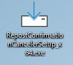  

2. 「次へ」ボタンをクリックします。

    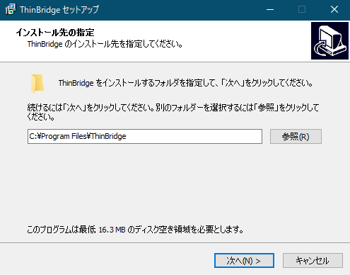  
    ■インストール先を変更する場合は、「参照」ボタンよりインストール先を変更します。

3. 「次へ」ボタンをクリックします。

    

4. 「インストール」ボタンをクリックします。

    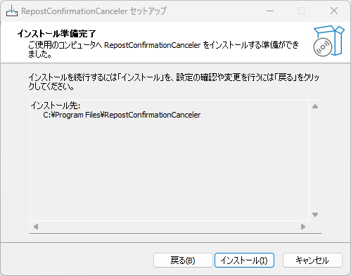

5. 「完了」ボタンをクリックします。

    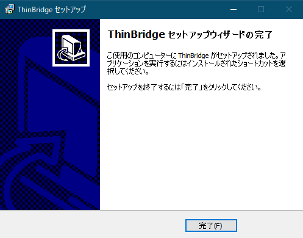

以上で、インストール作業は完了です。

\newpage
# アンインストール手順

## アンインストール方法 

1. コントロールパネルより「プログラムと機能」を表示します。  

    **■管理者権限で実行してください。**

    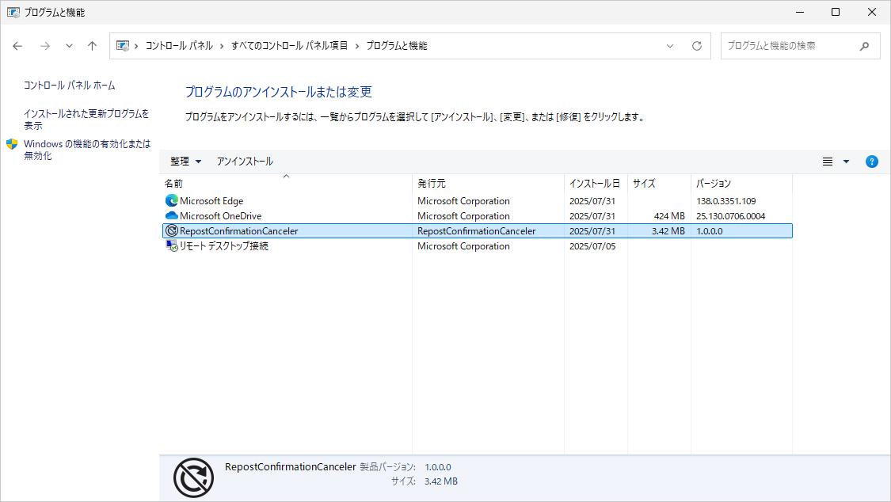

2. 一覧より「RepostConfirmationCanceler」を選択しダブルクリックします。

    

3. 「はい」ボタンをクリックします。

    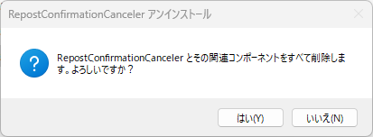

4. アンインストールが完了するとメッセージが表示されます。  

    [OK]をクリックします。

    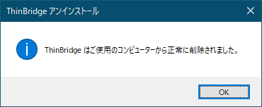

5. `<インストール先>\RepostConfirmationCanceler`フォルダーを削除します。

    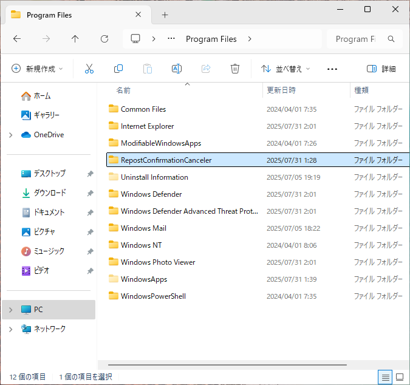

以上で、アンインストールは完了です。

\newpage
# サイレント インストール手順（自動インストール）

## RepostConfirmationCancelerサイレント インストールについて

RepostConfirmationCancelerのインストールをサイレント実行するための手順について記載します。

1.  応答ファイルの作成  

    **■デフォルト値でのサイレントインストールの場合は応答ファイルの作成は不要です。**

2.  サイレント インストールによるSetupの実行.

    **■管理者権限での実行が必要です。**

## 応答ファイルの作成

1. メモ帳を起動し`RepostConfirmationCanceler.inf`ファイルを作成します。

    

2. メモ帳に設定値を記述します。  

    インストール先とスタートメニューフォルダー名がカスタマイズ可能です。

    * インストール先: Dir
    * スタートメニューフォルダー名: Group

    ```
    [Setup]
    Lang=jp
    Dir=C:\Program Files\RepostConfirmationCanceler
    Group=RepostConfirmationCanceler
    NoIcons=0
    Tasks=
    ```

## サイレント インストール

### デフォルト値でのサイレント インストールの場合

**■デフォルト値でのサイレントインストールの場合は応答ファイルの作成は不要です。**

1. セットアップ用のEXEファイルに「/SP- /VERYSILENT」オプションを付与し実行します。  
  
    例) RepostConfirmationCancelerSetup_x64.exe /SP- /VERYSILENT</p>

### 応答ファイルを利用したサイレント インストールの場合

1. セットアップ用のEXEファイルに「/SP- /VERYSILENT **/LOADINF="RepostConfirmationCanceler.inf"**」オプションを付与し実行します。  

    例) RepostConfirmationCancelerSetup_x64.exe /SP- /VERYSILENT /LOADINF="RepostConfirmationCanceler.inf"

    ■応答ファイル RepostConfirmationCanceler.infはSetupファイルと同一フォルダーに設置するかフルパスを指定します。

\newpage
# サイレント アンインストール手順（自動アンインストール）

## RepostConfirmationCancelerサイレント アンインストールについて

RepostConfirmationCancelerのアンインストールをサイレント実行するための手順について記載します。

**■管理者権限での実行が必要です。**  

**ログ関連のフォルダーや設定ファイル関連はアンインストール後に削除されません。**

## サイレント アンインストール

1. RepostConfirmationCancelerセットアップ先にあるunins000.exeファイルに「/VERYSILENT」オプションを付与し実行します。  

    例) `"C:\Program Files\RepostConfirmationCanceler\unins000.exe" /VERYSILENT`

\newpage
# バージョンアップ手順

## RepostConfirmationCancelerバージョンアップについて

RepostConfirmationCancelerのアンインストールの必要はありません。上書きインストールを行ってください。  

■マイナーバージョンアップの場合はアンインストールの必要はありません。

## バージョンアップ方法

**RepostConfirmationCancelerのセットアップ用のインストーラーは2種類あります。**  
**御利用されるWindows環境に合わせてセットアップファイルを選択してください。**

* Windows 64bit(x64)環境用  
  * **RepostConfirmationCancelerSetup_x64.exe**

* Windows 32bit(x86)環境用  
  * **RepostConfirmationCancelerSetup_x86.exe**

Windows環境に合っていないセットアップファイルを実行すると以下のメッセージが表示されます。


> このプログラムは  
> x86プロセッサー向けの Windows にしかインストールできません。

対処方法：RepostConfirmationCancelerSetup_x64.exeを利用してください。


> このプログラムは  
> x64プロセッサー向けの Windows にしかインストールできません。

対処方法：RepostConfirmationCancelerSetup_x86.exeを利用してください。

## Windows 11(64bit)、Windows 10(64bit)環境のセットアップ例

1. RepostConfirmationCancelerSetup_x64.exeを実行します。  

    **■管理者権限で実行してください。**

    

2. 「インストール」ボタンをクリックします。

    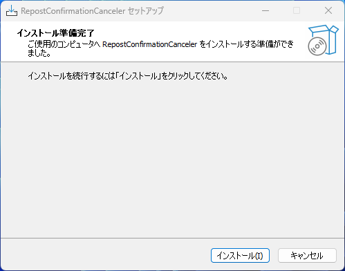

3. 「完了」ボタンをクリックします。

    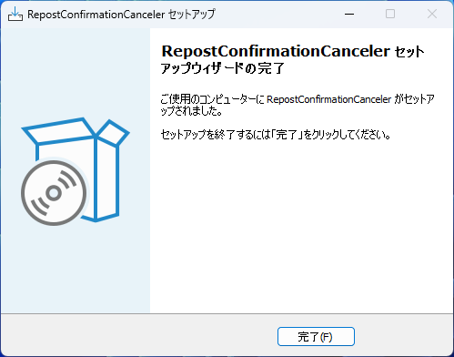

以上で、バージョンアップ作業は完了です。

\newpage
# Microsoft Edge RepostConfirmationCanceler拡張導入手順

## Microsoft EdgeへのRepostConfirmationCanceler拡張導入手順について

Microsoft Edgeのアドオンストアから拡張機能をインストールします。

また、ADに所属している端末にMicrosoft Edgeへの拡張機能のインストールを強制する場合、グループポリシー(GPO)でインストールを強制します。

### Microsoft EdgeのアドオンストアからのRepostConfirmationCanceler拡張の導入手順

* <https://microsoftedge.microsoft.com/addons/detail/repostconfirmationcancele/oibalikebhofnalakmnpbdmjpkahagoa>を開きます
* インストールボタンから拡張機能をインストールします

### グループポリシー(GPO)を利用したRepostConfirmationCanceler拡張の導入手順

#### 前提

本項目の作業手順は以下の作業環境で実施することを想定します。

* 作業者：システム管理者 1名
* 作業環境：Active Directoryドメインコントローラーを操作可能な Windows 端末 1台

#### 手順

以下の作業はすべて、作業環境にて、システム管理者が管理者ユーザーアカウントで実施します。

1. ドメインコントローラーに、Microsoft Edgeのグループポリシー設定を行います。

    詳しくは、「Windowsデバイスで Microsoft Edge ポリシー設定を構成する」を参照ください。  
    https://learn.microsoft.com/ja-jp/deployedge/configure-microsoft-edge

2. ドメインコントローラーのグループポリシー管理コンソールを起動します。
3. 対象の端末の一般ユーザーに適用するためのGPOを作成します。 
4. 3で用意したGPOについて、  
「管理用テンプレート」  
→「Microsoft Edge」  
→「拡張機能」  
→「サイレントインストールされる拡張機能を制御する」  
をダブルクリックして、当該ポリシーの設定画面を開きます。
5. 設定の状態を「有効」に設定します。
6. 「表示...」をクリックして、値の設定画面を開きます。
7. 以下の項目を追加します。  
「oibalikebhofnalakmnpbdmjpkahagoa」  
8. 「OK」ボタンを押して、値の設定画面を閉じます。
9. 「OK」ボタンを押して、ポリシーの設定画面を閉じます。

以上の手順により、グループポリシー(GPO)により各端末に RepostConfirmationCanceler拡張機能がインストールされます。

グループポリシーが適用されると拡張機能の青のスライドバーの左隣に鍵マークが表示されます。

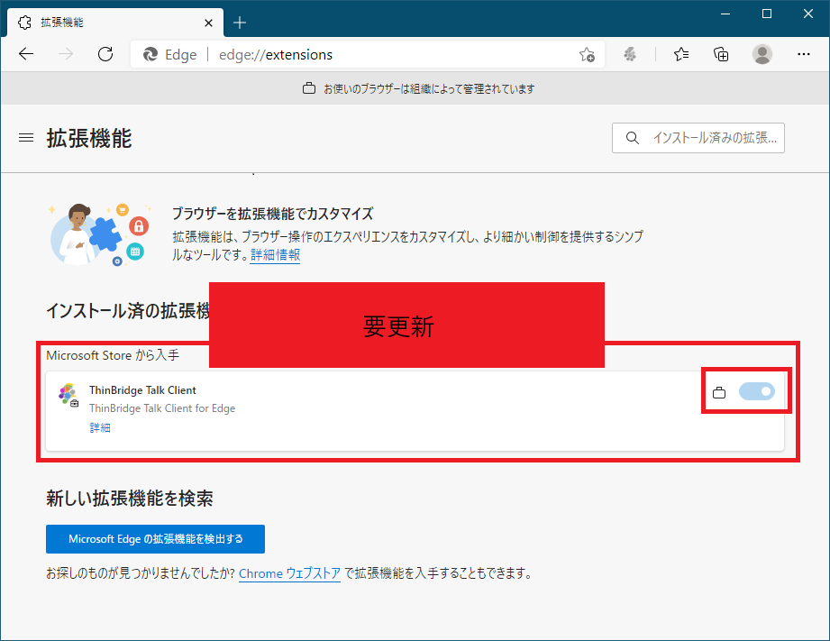

ユーザーは、拡張機能の削除や無効化を行うことはできません。

\newpage
# モジュール構成

## RepostConfirmationCancelerモジュール構成

RepostConfirmationCanceler インストーラーには以下のモジュールが含まれています。(合計 約15MB)

--------------------------------------------------------------------------------------
ファイル名                            サイズ           概要
------------------------------------- ---------------- --------------------------------
RepostConfirmationCanceler.exe        約16KB           ダイアログキャンセルモジュール

`RepostConfirmationCancelerHost\` \   約160KB          モダンブラウザー拡張連携
RepostConfirmationCancelerTalk.exe

`RepostConfirmationCancelerHost\` \   約1KB             Microsoft Edge拡張連携
edge.json
--------------------------------------------------------------------------------------

# 設定概要

RepostConfirmationCancelerは設定ファイルにより動作を変更することができます。

## 設定ファイルの場所

RepostConfirmationCancelerセットアップ先のRepostConfirmationCanceler.iniファイル

例) `C:\Program Files\RepostConfirmationCanceler\RepostConfirmationCanceler.ini`

## 設定ファイルの書式

設定ファイルは、以下のように`[GLOBAL]`セクションと`[TARGETS]`セクションに分かれています。

```
[GLOBAL]
@WARNING_WHEN_CLOSE_DIALOG

[TARGETS]
https://example.com/*
-https://example.com/test/
```

各セクションに対して、必要な項目を設定します。

また、先頭に`#`をつけることで、行をコメントアウトすることができます。

## 設定項目の一覧

### 一般設定

一般設定については、`[GLOBAL]`セクションに記載します。

| 項目                       | 設定内容                               | 既定  |
|----------------------------|---------------------------------------|------|
| @WARNING_WHEN_CLOSE_DIALOG | 「フォームを再送信しますか?」ダイアログをキャンセルしたとき、追加の警告ダイアログを表示する | 無効 |

#### @WARNING_WHEN_CLOSE_DIALOG

「フォームを再送信しますか?」ダイアログをキャンセルしたとき、以下のような追加の警告ダイアログを表示します。

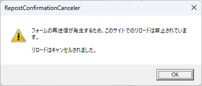

以下のように値なしのパラメータとして指定します。

```
[GLOBAL]
@WARNING_WHEN_CLOSE_DIALOG
```

「フォームを再送信しますか?」のエラーページ（ERR_CACHE_MISS）を閉じるケースでは、この警告ダイアログは表示されません。

### 対象URL一覧

対象URL一覧については、`[TARGETS]`セクションに記載します。

| 項目       | 設定内容                               | 既定  |
|------------|---------------------------------------|------|
| 対象URL一覧（書式は後述） | 「フォームを再送信しますか?」ダイアログをキャンセルするURL|*（すべてのURL）|

注: 

「フォームを再送信しますか?」ダイアログのキャンセル機能は、いずれかのタブで対象URLを開いている場合に動作します。
実際に開いているURLが対象URLでなくても、別のタブで対象URLを開いている場合、「フォームを再送信しますか?」ダイアログがキャンセルされます。

一方、「フォームを再送信しますか?」エラーページ（ERR_CACHE_MISS）を閉じる機能は対象URLでのみ動作します。

#### 対象URL一覧書式

対象URL一覧は以下のようにURL全体を改行切りで指定します。

例) 

```
[TARGETS]
https://www.clear-code.com/
https://example.com/
```

ワイルドカード「`*`」「`?`」を利用することが可能です。
「`*`」は0文字以上の任意の文字列を表し、「`?`」は任意の1文字を表します。

例) 

* `*://example.com*`
  * ドメイン名にexample.comを含むサイトがマッチします。
  * 例) 
    * `http://example.com/`
    * `https://example.com/`
    * `https://example.com/example`
* `*://example.??/*`
  * exampleドメインのサブドメインが二文字であるサイトがマッチします。
  * 例) 
    * `https://example.jp/`
    * `https://example.au/`

また、先頭に`-`をつけることで、除外URLを指定することが可能です。

例) 

```
[TARGETS]
https://example.com/*
-https://example.com/test/
```

これは「`https://example.com/`を含むサイトを対象とするが、`https://example.com/test/`は除外する」という設定です。

## グループポリシー(GPO)を利用した設定ファイルの配布手順

ADに所属している端末の設定を強制する場合、グループポリシー(GPO)で設定ファイルを配布することで強制します。

### 前提

本項目の作業手順は以下の作業環境で実施することを想定します。

* 作業者：システム管理者 1名
* 作業環境：Active Directoryドメインコントローラーを操作可能な Windows 端末 1台
* 適用時に必要なサーバー：全端末からアクセス可能なファイル配布用サーバー 1台

### GPOによる「RepostConfirmationCanceler.ini」の書き換え

以下の作業はすべて、作業環境にて、システム管理者が管理者ユーザーアカウントで実施します。

1. 各端末からアクセス可能なファイル配布用サーバー上に、一般ユーザー権限で読み取り可能な、ファイル配布用フォルダーを作成します。  
以下、コンピューター名/ホスト名が「fileserver」である Windowsファイル共有サーバーを使用し、ファイル配布用フォルダー名は「repost-confirmation-canceler」を使用するものと仮定します。  
この仮定に従い、ファイル共有サーバー上に作成された共有フォルダーのUNCパスが「`\\fileserver\repost-confirmation-canceler\`」 となると仮定します。
2. 強制したい設定がされた RepostConfirmationCanceler.ini ファイルを作成します。
3. 作成したファイルを、1で作成したファイル配布用フォルダーにコピーします。
前述の仮定に従い、ファイルの UNC パスは  
「`\\fileserver\repost-confirmation-canceler\RepostConfirmationCanceler.ini`」  
となると仮定します。
4. 配置した各ファイルの「プロパティ」を開き、「セキュリティ」タブを選択して、当該ファイルが「Everyone」で読み取り可能な状態になっていることを確認します。  
もしそのようになっていない場合は、「編集」ボタンをクリックし、開かれたダイアログ内で「追加」ボタンをクリックして、開かれたダイアログ内で「選択するオブジェクト名を入力してください」欄に「Everyone」と入力し、「OK」ボタンを押してダイアログを閉じる操作を3回繰り返して、ファイルを「Everyone」で読み取り可能な状態に設定します。
5. 任意のADドメイン参加端末に一般ユーザーでログインし、3で配置したファイルを読み取れることを確認します。
  * RepostConfirmationCanceler.ini（前述の仮定に従うと「`\\fileserver\repost-confirmation-canceler\RepostConfirmationCanceler.ini`」）をメモ帳などで開き、内容を閲覧できることを確認します。
6. ドメインコントローラーのグループポリシー管理コンソールで、対象の端末の一般ユーザーに適用されるGPOについて、 
「ユーザーの構成」  
→「基本設定」  
→「Windows の設定」  
→「ファイル」  
を右クリックし「新規作成」から「ファイル」を選択します。
7. 以下の通り設定します。
  * アクション：「置換」を選択。
  * ソースファイル：3 で配置した「RepostConfirmationCanceler.ini」を、全端末から参照可能な UNCパスで指定。（例：「`\\fileserver\repost-confirmation-canceler\RepostConfirmationCanceler.ini`」）
  * ターゲットファイル：「`C:\Program Files\RepostConfirmationCanceler\RepostConfirmationCanceler.ini`」を指定。
  * 属性：「読み取り専用」のみにチェック。

以上の手順により、組織内サーバーに設置したRepostConfirmationCanceler.iniが、各端末に導入されます。

# 「フォームを再送信しますか?」ダイアログの抑止動作確認

1. Microsoft Edgeを起動します。
2. 設定ファイルの対象URL一覧で指定した、動作対象のURLにアクセスします。
3. 動作対象のURLで一度フォームデータを送信します。
4. リロードを実行します。
5. 「フォームを再送信しますか?」ダイアログが自動でキャンセルされることを確認します。

なお、いずれかのタブで動作対象のURLを開いている場合、すべてのタブが「フォームを再送信しますか?」ダイアログの自動キャンセルの対象となります。
