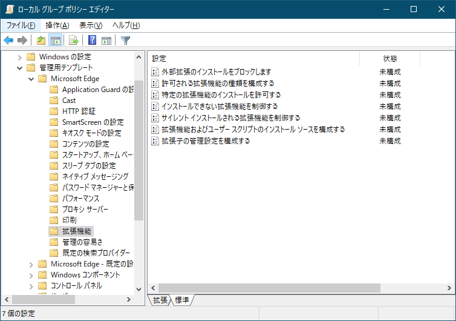
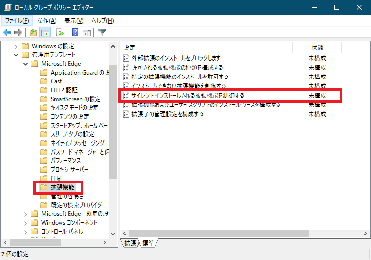
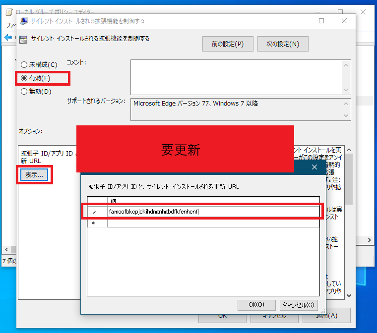
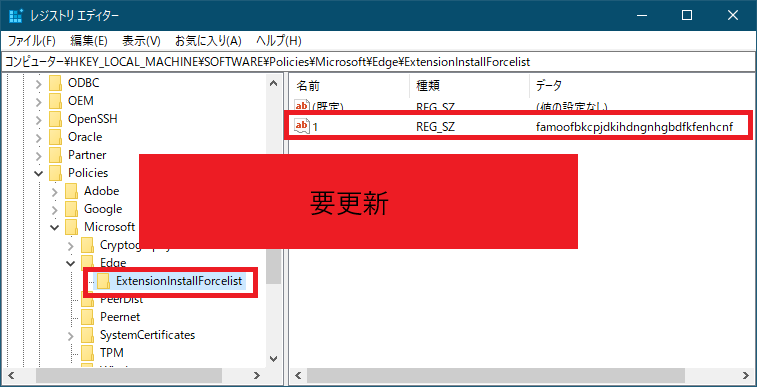

更新履歴

| 日付       | Version | 備考                              |
|------------|---------|-----------------------------------|
| 2025/09/26 | 1.0.0    | 第1版                             |

**本書について**

本書は、株式会社クリアコードが、RepostConfirmationCancelerを御利用いただく管理者向けに作成した資料となります。2025年9月時点のデータにより作成されており、それ以降の状況の変動によっては、本書の内容と事実が異なる場合があります。また、本書の内容に基づく運用結果については責任を負いかねますので、予めご了承下さい。

本書で使用するシステム名、製品名は、それぞれの各社の商標、または登録商標です。なお、本文中ではTM、®、©マークは省略しています。

\newpage
# RepostConfirmationCanceler概要

## RepostConfirmationCancelerとは

WEBサイトをリロードした際に「フォームを再送信しますか?」ダイアログが表示されたとき、自動でキャンセルしリロードを中止するソリューションです。
誤操作によるフォーム再送信の防止を目的としています。

\newpage
# システム要件

## 概要

RepostConfirmationCancelerが対応しているWindowsシステムについて、記述します。

## 動作サポートOS

**クライアント系OS**

- **Windows 11 (64bit)**
- **Windows 10 (64bit)**

## 動作サポート ブラウザー

- **Microsoft Edge (最新版) ■レガシーEdgeは非対応**

\newpage
# インストール手順

## RepostConfirmationCancelerインストールについて

RepostConfirmationCancelerを利用するために、別途ランタイムライブラリー(.NET Framework等)の追加インストールは必要ありません。

## インストール方法

**RepostConfirmationCancelerのセットアップ用のインストーラーは2種類あります。**  
**御利用されるWindows環境に合わせてセットアップファイルを選択してください。**

・Windows 64bit(x64)環境用  
**RepostConfirmationCancelerSetup_x64.exe**

・Windows 32bit(x86)環境用  
**RepostConfirmationCancelerSetup_x86.exe**

Windows環境に合っていないセットアップファイルを実行すると以下のメッセージが表示されます。


> このプログラムは  
> x86プロセッサー向けの Windows にしかインストールできません。

対処方法：RepostConfirmationCancelerSetup_x64.exeを利用してください。


> このプログラムは  
> x64プロセッサー向けの Windows にしかインストールできません。

対処方法：RepostConfirmationCancelerSetup_x86.exeを利用してください。

**■Windows 11(64bit)、Windows 10(64bit)環境のセットアップ例**

（1） RepostConfirmationCancelerSetup_x64.exeを実行します。

  
■管理者権限で実行してください。

（2） 「次へ」ボタンをクリックします。

  
■インストール先を変更する場合は、「参照」ボタンよりインストール先を変更します。

（3） 「次へ」ボタンをクリックします。


（4） 「インストール」ボタンをクリックします。


（5） 「完了」ボタンをクリックします。


以上で、インストール作業は完了です。

\newpage
# アンインストール手順

## アンインストール方法 

（1）コントロールパネルより「プログラムと機能」を表示します。  
**■管理者権限で実行してください。**


（2）一覧より「RepostConfirmationCanceler」を選択しダブルクリックします。


（3）「はい」ボタンをクリックします。


（4）アンインストールが完了するとメッセージが表示されます。  
[OK]をクリックします。


（5）`<インストール先>\RepostConfirmationCanceler`フォルダーを削除します。


以上でアンインストールは、完了です。

\newpage
# サイレント インストール手順（自動インストール）

## RepostConfirmationCancelerサイレント インストールについて

RepostConfirmationCancelerのインストールをサイレント実行するための手順について記載します。

以下の環境用のSetupではサイレント インストールが可能です。  
**■管理者権限での実行が必要です。**

1.  応答ファイルの作成  
**■デフォルト値でのサイレントインストールの場合は応答ファイルの作成は不要です。**

2.  サイレント インストールによるSetupの実行.

## 応答ファイルの作成

（1）メモ帳を起動し`RepostConfirmationCanceler.inf`ファイルを作成します。


（2）メモ帳に設定値を記述します。  
カスタマイズ可能な項目は、インストール先とスタートメニューフォルダー名になります。

**インストール先：**  
**Dir=**

**スタートメニューフォルダー名：**  
**Group=**

```
[Setup]
Lang=jp
Dir=C:\Program Files\RepostConfirmationCanceler
Group=RepostConfirmationCanceler
NoIcons=0
Tasks=
```

## サイレント インストール

**デフォルト値でのサイレント インストールの場合**  
**■デフォルト値でのサイレントインストールの場合は応答ファイルの作成は不要です。**

（1）セットアップ用のEXEファイルに「/SP- /VERYSILENT」オプションを付与し実行します。  
例) RepostConfirmationCancelerSetup_x64.exe /SP- /VERYSILENT</p>

**応答ファイルを利用したサイレント インストールの場合**

（1）セットアップ用のEXEファイルに「/SP- /VERYSILENT **/LOADINF="RepostConfirmationCanceler.inf"**」オプションを付与し実行します。  
例) RepostConfirmationCancelerSetup_x64.exe /SP- /VERYSILENT /LOADINF="RepostConfirmationCanceler.inf"

■応答ファイル RepostConfirmationCanceler.infはSetupファイルと同一フォルダーに設置するかフルパスを指定します。

\newpage
# サイレント アンインストール手順（自動アンインストール）

## RepostConfirmationCancelerサイレント アンインストールについて

RepostConfirmationCancelerのアンインストールをサイレント実行するための手順について記載します。

以下の環境用のSetupではサイレント アンインストールが可能です。  
**■管理者権限での実行が必要です。**  
**ログ関連のフォルダーや設定ファイル関連はアンインストール後に削除されません。**

## サイレント アンインストール

（1）RepostConfirmationCancelerセットアップ先にあるunins000.exeファイルに「/VERYSILENT」オプションを付与し実行します。  
例) `"C:\Program Files\RepostConfirmationCanceler\unins000.exe" /VERYSILENT`

\newpage
# バージョンアップ手順

## RepostConfirmationCancelerバージョンアップについて

RepostConfirmationCancelerのアンインストールの必要はありません。上書きインストールを行ってください。  
■マイナーバージョンアップの場合はアンインストールの必要はありません。

## バージョンアップ方法

**RepostConfirmationCancelerのセットアップ用のインストーラーは2種類あります。**  
**御利用されるWindows環境に合わせてセットアップファイルを選択してください。**

・Windows 64bit(x64)環境用  
**RepostConfirmationCancelerSetup_x64.exe**

・Windows 32bit(x86)環境用  
**RepostConfirmationCancelerSetup_x86.exe**

Windows環境に合っていないセットアップファイルを実行すると以下のメッセージが表示されます。


> このプログラムは  
> x86プロセッサー向けの Windows にしかインストールできません。

対処方法：RepostConfirmationCancelerSetup_x64.exeを利用してください。


> このプログラムは  
> x64プロセッサー向けの Windows にしかインストールできません。

対処方法：RepostConfirmationCancelerSetup_x86.exeを利用してください。

**■Windows 11(64bit)、Windows 10(64bit)環境のセットアップ例**

（1）RepostConfirmationCancelerSetup_x64.exeを実行します。  
**■管理者権限で実行してください。**


（2）「インストール」ボタンをクリックします。


（3）「完了」ボタンをクリックします。


以上で、バージョンアップ作業は完了です。

\newpage
# Microsoft Edge RepostConfirmationCanceler拡張導入手順

## Microsoft EdgeへのRepostConfirmationCanceler拡張導入手順について

Microsoft Edgeのアドオンストアから拡張機能をインストールします。

また、ADに所属している端末にMicrosoft Edgeへの拡張機能のインストールを強制する場合、グループポリシー(GPO)でインストールを強制します。

### Microsoft EdgeのアドオンストアからのRepostConfirmationCanceler拡張の導入手順

* <RepostConfirmationCancelerのアドオンページのURL>を開きます
* インストールボタンから拡張機能をインストールします

### グループポリシー(GPO)を利用したRepostConfirmationCanceler拡張の導入手順

**予めMicrosoft Edgeのグループポリシー設定が完了した環境での手順になります。**

詳しくは、「Windowsデバイスで Microsoft Edge ポリシー設定を構成する」を参照ください。  
https://learn.microsoft.com/ja-jp/deployedge/configure-microsoft-edge

（1）グループポリシーエディターを起動します。



（2）「管理用テンプレート」―「Microsoft Edge」―「拡張機能」を選択します。  
「サイレント インストールされる拡張機能を制御する」をダブルクリックします。



（3）「有効」を選択します。

オプション：  
「表示…」をクリックします。

表示するコンテンツ画面でRepostConfirmationCanceler拡張アプリID「<ストア登録後の拡張機能のIDに変更する>」を入力します。



■RepostConfirmationCanceler拡張アプリID  
<ストア登録後の拡張機能のIDに変更する>

（4）グループポリシーが適用されると、レジストリの以下のキーに値が追加されます。

`\SOFTWARE\Policies\Microsoft\Edge\ExtensionInstallForcelist`



（5）グループポリシーを利用し自動的に拡張機能が有効化されます。  
ユーザーは、拡張機能の削除や無効化を行うことはできません。

グループポリシーが適用されると青のスライドバーの左隣に鍵マークが表示されます。


\newpage
# モジュール構成

## RepostConfirmationCancelerモジュール構成

RepostConfirmationCanceler インストーラーには以下のモジュールが含まれています。(合計 約15MB)

--------------------------------------------------------------------------------------------
ファイル名                       サイズ           概要
-------------------------------- ---------------- ------------------------------------------
RepostConfirmationCanceler.exe                   約16KB          ダイアログキャンセルモジュール

`RepostConfirmationCancelerHost\` \              約160KB          モダンブラウザー拡張連携
RepostConfirmationCancelerTalk.exe

`RepostConfirmationCancelerHost\` \              約1KB            Microsoft Edge拡張連携
edge.json
--------------------------------------------------------------------------------------------

# 設定概要

RepostConfirmationCancelerは設定ファイルにより動作を変更することができます。

## 設定ファイルの場所

RepostConfirmationCancelerセットアップ先のRepostConfirmationCanceler.iniファイル
例) `C:\Program Files\RepostConfirmationCanceler\RepostConfirmationCanceler.ini`

## 設定項目の一覧

Edgeでの動作については、`[Edge]`セクションに記載します。

| 項目       | 設定内容                                                | 既定  |
|------------|--------------------------------------------------------|------|
| 対象URL一覧（書式は後述） | 「フォームを再送信しますか?」ダイアログを自動でキャンセルする対象のURL一覧|*（すべてのURL）|

注: いずれかのタブで対象URLを開いている場合に本プログラムが動作します。実際に開いているURLが対象URLでなくても、別のタブで対象URLを
開いている場合、「フォームを再送信しますか?」ダイアログがキャンセルされます。

### 対象URL一覧書式

対象URL一覧は以下のようにURL全体を改行切りで指定します。

例) 

```
[Edge]
https://www.clear-code.com/
https://example.com/
```


イルドカード「`*`」「`?`」を利用することが可能です。
「`*`」は0文字以上の任意の文字列を表し、「`?`」は任意の1文字を表します。

例) 

* `*://example.com*`
  * ドメイン名にexample.comを含むサイトがマッチします。
  * 例) 
    * `http://example.com/`
    * `https://example.com/`
    * `https://example.com/example`
* `*://example.??/*`
  * exampleドメインのサブドメインが二文字であるサイトがマッチします。
  * 例) 
    * `https://example.jp/`
    * `https://example.au/`

また、先頭に`-`をつけることで、除外URLを指定することが可能です。

例) 

```
[Edge]
https://example.com/*
-https://example.com/test/
```

これは「`https://example.com/`を含むサイトを対象とするが、`https://example.com/test/`は除外する」という設定です。